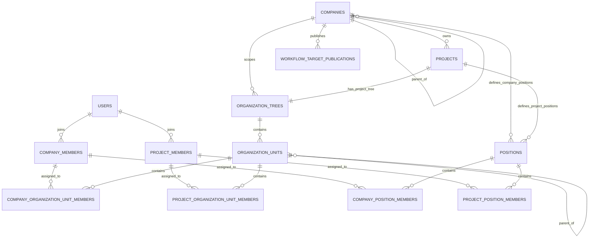

# 集团、企业与项目组织架构、岗位及跨层级流转设计方案

> 状态：待确认，确认后再进入实施  
> 日期：2026-09-16  
> 关联文档：[企业、项目与菜单权限管理实施计划](./需求文档.md)

## 一、核心推荐

本方案的核心推荐如下，详细约束和确认状态以后续章节为准：

1. **树节点统一称为“组织单元”。**部门、事业部、区域、中心、科室和班组都只是组织单元的业务形态。
2. **集团／企业主体、企业组织树和项目组织树分开建模。**集团与独立子企业是具有各自 `companyId` 的企业实体；企业和项目各维护自己的组织树，界面可以聚合浏览，但数据库不建立跨树父子关系。
3. **企业父子关系不继承成员和权限。**项目只归属直接企业，父集团、子企业和兄弟企业之间的管理或流程流转都需要显式授权。
4. **企业组织承接企业治理和跨项目职能，项目组织承接项目执行。**项目可以使用企业模板初始化自己的组织，之后独立维护；首期不新增项目小组。
5. **组织归属、岗位和权限角色相互独立。**岗位是企业／项目作用域内的平面岗位库，不关联组织单元；成员可以同时加入多个组织单元、担任多个岗位并负责多个组织单元，所有组织成员关系地位相同。
6. **项目流程只可使用直接所属企业明确发布的组织单元、岗位或成员目标。**跨层级处理人只获得任务级最小访问权，不自动成为项目成员。
7. **平台账号以全局 `userId` 唯一标识。**全局账号选择、具体成员选择和工作流目标选择使用职责不同的选择器，姓名与组织标签只用于识别和筛选。
8. **组织单元排序统一使用一个整数 `sort`。**前端只提供一个整数输入框，数据库、接口和模板直接保存该值。

## 二、背景与本期边界

现有系统已经完成平台、企业、项目三级 `AccessScope`，并具备企业成员、项目成员、企业角色、项目角色及权限隔离。上一期需求明确没有引入组织单元树和审批流，因此本设计属于现有权限体系之上的下一阶段扩展，不替换已有成员与角色模型。

本设计聚焦四类问题：企业主体与组织树的边界；组织归属、岗位和权限的关系；项目组织初始化及跨层级流程；配套的数据、接口、页面、选择器、生命周期和审计规则。

本设计暂不展开完整审批引擎、表单设计器、条件表达式、会签算法和字段级权限，只定义组织能力与未来工作流之间必须稳定的边界和契约。

## 三、核心概念

| 概念               | 归属                 | 主要用途                                         | 是否进入组织单元树 | 是否直接授予系统权限 |
| ------------------ | -------------------- | ------------------------------------------------ | ------------------ | -------------------- |
| 平台账号           | 平台全局             | 登录身份，使用全局唯一 `userId`                  | 否                 | 否                   |
| 集团／企业主体     | 企业作用域           | 独立成员、权限、数据、审计及项目归属边界         | 否                 | 通过企业角色授权     |
| 企业成员           | 某一集团或企业主体   | 表示账号与该企业作用域的成员关系                 | 否                 | 通过企业角色授权     |
| 项目成员           | 某一项目             | 表示企业成员参与某个项目                         | 否                 | 通过项目角色授权     |
| 企业组织单元       | 某一集团或企业主体   | 内部层级、人员归属、跨项目职能、流程承接         | 是                 | 否                   |
| 项目组织单元       | 某一项目             | 项目执行组织、人员归属、项目内流程承接           | 是                 | 否                   |
| 企业／项目权限角色 | 对应作用域           | RBAC 权限集合，例如企业管理员、资料维护员        | 否                 | 是                   |
| 企业／项目岗位     | 对应企业或项目作用域 | 业务任职，例如董事、财务负责人、项目经理、资料员 | 否                 | 否                   |
| 组织单元负责人     | 某个组织单元成员关系 | 主要负责人、副负责人、流程可寻址对象             | 否                 | 否                   |

### 3.1 组织单元的价值与边界

“组织单元”是通用树节点，用于表达稳定层级、人员归属、通讯录、统计及流程承接。名称不决定系统行为，首期不硬编码“集团、公司、部门、班组”等类型；以后可以增加只影响展示和统计的可配置分类。

组织单元不是新的 `AccessScope`，不会因为名称叫“A 公司”就自动拥有独立管理员、成员目录、权限、项目或数据边界。项目组织模板复制的是项目自己的组织结构，也不是企业组织树的实时映射。

### 3.2 集团、独立企业、组织单元与项目

集团和真正独立的 A/B/C 企业都使用现有 `company` 作用域，通过 `companies.parentCompanyId` 形成企业层级，并用 `entityType` 区分展示语义，不新增 `group` 作用域。项目只保存直接所属企业的 `companyId`。

判断一个节点应建成企业还是组织单元，只看它是否需要独立的成员目录、管理员、RBAC、数据、审计、生命周期或直接拥有项目：需要则建企业实体；只用于汇报、分类或内部管理则建组织单元。企业父子关系只用于层级和导航，不自动产生权限继承或跨企业流程资格。

### 3.3 稳定组织与临时协作

首期不新增“项目小组”概念，避免它与项目组织单元、岗位及临时选人重叠：

- 长期存在、有稳定负责人、可能有上下级或需要作为正式组织管理的结构，例如“施工一组”，直接作为项目组织单元。
- 项目成员可同时加入多个项目组织单元，因此跨组织协作不需要再建立小组。
- 临时任务或专题协作直接选择一个或多个项目成员，只在具体业务或流程中保存接收人，不形成新的组织关系。
- 将来只有出现高频复用、独立生命周期和独立管理诉求时，才另行设计协作组；本期数据库、接口、页面和选择器均不预留项目小组实体。

## 四、组织树模型

### 4.1 聚合视图是一棵树，领域模型是一片森林

前端可以提供下面的统一浏览视图：

```text
平台
└─ XX 集团
   ├─ 集团组织架构
   │  ├─ 集团财务中心
   │  └─ 法务中心
   └─ 下属企业
      └─ A 企业
         ├─ 企业组织架构
         │  ├─ 华东事业部
         │  │  └─ 财务部
         │  └─ 人力资源部
         └─ 项目
            └─ 项目甲
               └─ 项目组织架构
                  ├─ 工程部
                  └─ 商务部
```

但这只是导航和选择时的聚合展示，真实父子关系必须满足：

- 集团和子企业之间是 `companies` 的父子关系，不是组织单元父子关系。
- 企业组织单元的父节点只能是同一企业树中的组织单元。
- 项目组织单元的父节点只能是同一项目树中的组织单元。
- 企业组织单元与项目组织单元之间不建立真实父子关系。
- 项目组织单元不得跨项目或跨企业移动；如需复用，只能通过模板或显式复制。
- 项目默认只显示在直接所属企业下，真实归属以项目 `companyId` 为准。若以后允许项目额外关联企业组织单元用于导航或统计，必须使用独立的非权限字段表达，不能把前端树位置当作组织单元真实父子关系。

这样既保留了“一棵大树”的使用体验，也避免集团、企业、组织单元和项目的权限边界被一棵通用树混淆。

### 4.2 组织成员关系

组织成员关系采用普通多对多模型：

- 一个企业成员可以加入多个企业组织单元，一个项目成员也可以加入当前项目的多个项目组织单元。
- 同一账号在企业和不同项目中的组织归属分别维护，互不覆盖。
- 不设置默认组织，也不能根据提交顺序、数组第一项或展示顺序推导特殊组织关系。
- 成员可以暂时没有组织归属，前端以“未归属组织”虚拟节点展示，不创建真实组织单元记录。
- 组织单元成员关系只表示组织归属，不自动分配或撤销权限角色。

组织单元负责人建议采用：

- 每个组织单元最多一名主要负责人。
- 可以有多名副负责人。
- 同一个人可以担任多个企业或项目组织单元的主要负责人、副负责人；限制作用在“每个组织单元最多一名主要负责人”，不限制一个人能负责多少组织单元。
- 负责人必须是当前组织单元成员，并满足对应企业成员或项目成员资格；同一个人可以在多个组织单元分别任职。
- 设置负责人不会自动授予管理员角色；如需管理权限，仍通过现有角色体系显式授权。

### 4.3 岗位、组织单元与权限角色的边界

现有 `roles` 继续负责菜单、页面和接口权限；“董事、财务负责人、项目经理”等业务任职使用独立岗位。岗位的价值是形成稳定的任职名单、流程目标和责任统计，让人员换岗不必移动组织或改写权限角色。

岗位遵循以下边界：

- 岗位只属于一个企业或项目，是平面实体，不进入组织树，也不保存 `organizationUnitId`。
- 岗位任职与组织归属分别维护和审计，支持一人多岗、一岗多人；岗位不会自动创建 RBAC 角色关系。
- 企业岗位“财务负责人”和“财务部组织单元负责人”是两个独立目标，需要同一人兼任时分别配置。
- 系统可以查询“某企业有哪些董事”，但不能仅凭岗位得出“谁是财务部的出纳”。选择器可以临时用组织与岗位交叉筛选具体人员，但只保存所选人员，不保存两者的关联。
- 按权限角色选人仍通过现有角色关系完成，并在选择器中与岗位分栏展示。

### 4.4 组织单元排序

企业和项目组织单元使用同一套简单排序规则。数据库、接口、模板和前端统一使用一个非负整数 `sort`，前端只提供一个整数输入框，编辑时直接回显和提交原值，数值越小越靠前。

- 排序只在同一棵树、同一个父组织单元下比较，统一使用 `sort ASC, id ASC`；相同 `sort` 时按 `id` 保证稳定顺序。
- `sort` 的统一范围为 `0～999999999`，只接受整数，不接受小数、浮点数或负数。
- 新建的首个同级组织单元默认使用 `sort = 1`；其余默认使用同级最大 `sort + 1`。达到上限时不再自动递增，要求用户先调整现有顺序。
- 用户可以直接修改 `sort`，系统不要求预留固定间隔，也不因单个节点排序变化自动重排其他节点。
- 移动组织单元时可以显式填写新 `sort`；未填写时默认排到目标父组织单元最后，并使用目标同级最大 `sort + 1`。

## 五、项目组织模板

为同时满足“企业有一套通用标准”和“项目存在差异”，建议由企业维护**项目组织模板**，而不是让项目实时引用企业组织单元树。

创建项目时提供三种选择：

1. 使用企业默认模板。
2. 选择企业中的其他项目组织模板。
3. 空白创建。

模板复制规则：

- 复制组织单元名称、编码、层级和 `sort` 原值。
- 模板可以包含与组织单元结构相互独立的项目岗位定义，但不复制真实成员、负责人、岗位任职和权限角色分配。
- 每个项目组织单元和岗位定义分别生成新的 ID，并记录各自的来源模板节点或来源模板岗位；复制岗位时不建立任何组织单元 ID 映射。
- 项目创建后独立维护；企业修改模板不会自动改动已有项目。
- 后续如需同步，只能提供“查看差异 → 选择应用”的显式操作，不能后台静默同步。

这能避免企业标准变化导致在建项目组织和流程突然变化。

## 六、跨层级工作流

### 6.1 合理场景

下面的流程是合理且应被支持的：

```text
项目付款申请
  → 项目商务部负责人审核
  → 企业财务部负责人审批
  → 抄送企业中的某位董事
```

项目流程允许引用的目标建议包括：

| 目标类型       | 示例                   | 运行时处理                                                     |
| -------------- | ---------------------- | -------------------------------------------------------------- |
| 具体成员       | 某位董事、某位项目经理 | 解析为一个有效 `userId`                                        |
| 组织单元负责人 | 企业财务部负责人       | 读取当前主要负责人；缺失时默认解析异常，可显式配置副负责人回退 |
| 组织单元成员   | 企业财务部全员         | 主要用于抄送，不建议默认用于审批                               |
| 岗位成员       | 企业岗位“董事”         | 解析目标企业或项目中担任该岗位的全部有效成员                   |
| 权限角色成员   | 项目角色“项目管理员”   | 仅在确有按权限身份流转的场景使用                               |

选择“组织单元”本身时必须进一步说明是“组织单元负责人”还是“组织单元全部成员”，不能留下含义不明确的组织目标。

审批与抄送使用不同规则：

- 审批人拥有任务处理权，并参与节点完成条件；组织单元审批默认解析主要负责人。
- 抄送人只获得指定内容的只读权，不参与节点完成计数；组织单元抄送可以显式选择全部有效成员。
- “包含下级组织单元”默认关闭，必须由流程设计者显式开启。
- 对“组织单元成员”开启时，解析选中组织单元及全部有效下级组织单元的有效成员并取并集；对“组织单元负责人”开启时，分别解析选中组织单元及每个有效下级组织单元的负责人，每个组织单元独立应用负责人缺失回退规则，任一无法解析且回退为 `error` 时整个节点进入解析异常。
- 组织单元没有主要负责人时默认进入“接收人解析异常”，不得静默扩大为全部成员；流程设计者可以显式配置回退到任一副负责人或全部副负责人。
- 大型组织单元选择“全部成员审批”时必须展示预计接收人数并二次确认，避免意外创建大量任务。

### 6.2 跨层级限制

项目流程访问企业组织时必须同时满足：

1. **直接所属企业限制**：目标企业 `companyId` 必须严格等于项目直接所属 `companyId`；父集团、子企业、兄弟企业和其他项目均不满足此条件。
2. **项目侧权限**：操作者具有流程设计及使用企业接收目标的权限。
3. **企业侧发布**：企业管理员明确将相应组织单元负责人、组织单元成员、企业岗位成员或具体成员发布到“项目流程接收人目录”。

推荐默认不把整个企业通讯录暴露给所有项目。项目侧只看到直接所属企业发布的组织单元、岗位、成员及必要的最小人员信息；具体人员搜索还要受到候选接口权限限制。

现有 RBAC 权限角色只允许在流程定义所属的当前作用域内使用。例如项目流程可以引用本项目的“项目管理员”角色成员，但不能由企业把“企业管理员”角色跨层级发布给项目；企业跨层级发布首期只允许组织单元负责人、组织单元成员、企业岗位成员和具体企业成员。

### 6.3 规则引用、运行时解析与快照

工作流定义和实例应分别保存不同内容：

- **流程定义**保存稳定规则，例如企业组织单元 ID、岗位 ID、解析方式，不提前写死最终接收人。
- **发布流程定义时**校验目标存在、作用域合法、状态有效、已向项目发布，并记录目标名称、所属企业／项目名称以及组织单元目标的完整路径快照用于展示；同名组织单元不能只保存末级名称。
- **节点激活时**按最新组织和成员状态解析接收人。
- **接收人去重**以同一节点、同一接收类型下的 `userId` 为准；同一人通过多个组织单元、负责人规则或岗位重复命中时，只创建一份审批任务或抄送记录，但必须保留每个来源目标的类型、ID、作用域、名称，以及组织单元来源适用的完整路径用于展示与审计。
- **流程实例任务**保存最终接收人的 `userId`、姓名、完整账号、全部来源目标、组织单元来源适用的完整路径、解析时间等快照，保证后续组织或岗位调整不会篡改历史记录。

若节点激活时找不到有效接收人，不应跳过审批或自动扩大接收范围。该节点进入“接收人解析异常”，通知流程管理员选择替代人员并留下审计。

企业撤回或停用已发布目标时：

- 立即禁止新流程定义继续选择该目标，也禁止包含该目标的新版本发布。
- 已发布流程定义保留引用但标记为“配置待修复”；尚未激活到该目标的节点在激活时停止并进入“企业目标授权失效”，不得继续按旧发布关系解析。
- 已经生成的任务默认保留接收人快照；接收人仍具备该任务至少一条有效来源资格时继续保留处理权，企业管理员可以执行“紧急撤销并转交”。目标撤回或停用本身不改写历史快照，人员资格失效仍按 6.4 节立即限制；两种处理都必须记录审计。

### 6.4 跨层级人员的访问权

企业财务人员处理项目付款流程时：

- 不自动创建项目成员关系。
- 不自动分配项目角色。
- 不自动获得项目菜单和项目工作空间访问权。
- 只通过“流程任务参与者”获得当前流程实例、当前任务及必要附件的最小访问权。
- 任务完成、撤回或流程结束后，按规则结束或收缩该临时访问权。

因此现有普通项目 `AccessScope` 鉴权之外，工作流阶段需要新增专门的任务级资源授权策略，不能只依赖“是否为项目成员”。

本设计不定稿完整工作流表结构，只固定以下授权边界：

| 内容               | 最低要求                                                                |
| ------------------ | ----------------------------------------------------------------------- |
| 任务接收人         | 保存实际 `userId`、审批／抄送类型、全部来源目标、解析快照、状态和有效期 |
| 资源授权           | 保存该接收人可访问的流程、业务资源、附件范围和允许动作；抄送默认只读    |
| 项目来源资格       | 持续校验有效 `project_member` 及其关联的有效 `company_member`           |
| 企业跨层级来源资格 | 持续校验来源企业下的有效 `company_member`，不要求成为项目成员           |

同一接收人存在多个来源时，至少一条来源资格有效即可继续处理；全部失效时立即拒绝并进入待转交状态。资格失效只暂停当前授权，不删除任务接收人、来源和历史快照；资格恢复后，既有任务也不会自动恢复处理权，必须由流程管理员显式恢复原接收人或转交。详细表结构、附件权限、会签和转交规则在工作流专项设计中确认。

## 七、选择器设计

### 7.1 组件必须拆分

| 组件                         | 用途                                                       | 返回值                         |
| ---------------------------- | ---------------------------------------------------------- | ------------------------------ |
| `GlobalAccountSelect`        | 平台开通企业、设置企业管理员等需要从平台账号中选人的场景   | 单个全局 `userId`              |
| `OrganizationMemberSelector` | 从允许范围内选择一个或多个具体成员                         | `userId`，必要时连同成员作用域 |
| `WorkflowTargetSelector`     | 选择具体成员、组织单元负责人、组织单元成员、岗位或权限角色 | 带类型和作用域的目标联合类型   |

复杂组织选择器可以在表单中表现为一个 Select 风格的输入框，但打开后应是弹窗式组织浏览器，而不是把多层树、岗位、角色、项目和搜索结果全部塞进普通下拉菜单。

平台开通企业或设置企业管理员时，候选人经常还不是企业成员，因此继续使用 `GlobalAccountSelect`。创建项目、设置项目管理员或添加项目成员时，候选范围已经是企业成员，应使用组织成员选择器。

`GlobalAccountSelect` 只选择全局账号，不把企业成员或项目成员当成新账号实体。结果展示姓名、完整账号、状态和调用者有权看到的身份摘要，最终值始终是唯一 `userId`；候选范围由服务端按调用作用域裁剪。

### 7.2 组织成员选择器布局

```text
┌ 选择成员 ─────────────────────────────────────────┐
│ [搜索姓名或完整账号]                 [单选/多选]   │
├──────────────────┬────────────────────────────────┤
│ 企业 A              │ 姓名  完整账号  来源  组织归属  岗位 │
│ ├ 按组织架构        │ 张三  zhangsan  企业  财务部    董事 │
│ ├ 按岗位            │ 李四  lisi      项目甲 工程部  项目经理│
│ ├ 按权限角色        │                                    │
│ └ 项目              │                                    │
│    ├ 项目甲         │                                    │
│    │  ├ 按组织架构  │                                    │
│    │  ├ 按岗位      │                                    │
│    │  └ 按权限角色  │                                    │
│    └ 项目乙         │                                    │
├──────────────────┴────────────────────────────────┤
│ 已选：张三 · zhangsan · 企业 A             确定   │
└───────────────────────────────────────────────────┘
```

交互规则：

- 左侧先按可见企业、当前企业或项目缩小作用域，再按组织架构、岗位或权限角色筛选；右侧才选择具体成员。点击一个组织单元只表示筛选人员，不等于把整个组织单元作为选择值。
- “按组织架构”和“按岗位”是两套并列筛选入口。组织归属标签与岗位标签可以同时展示，也可以临时取交集帮助找人，但这不形成岗位与组织单元的持久关联；选择结果仍是具体成员或独立的流程目标。
- 企业层级、企业组织树和项目组织树可以在左侧聚合展示，树节点必须带 `scope` 和实体类型；数据查询、选中值和权限校验仍保持企业与项目隔离。
- 搜索结果按 `userId` 去重，每人只显示一行，并聚合展示全部可见企业／项目身份、组织归属、岗位、必要的权限角色和状态；姓名不作为唯一标识。
- 如果业务必须保留“以哪个企业/项目身份选择”，返回 `userId + OrganizationScope`，不能只返回表格行 ID。
- 同名组织单元必须展示“所属企业／项目 + 完整路径”或面包屑，例如 `A 企业 / 华东事业部 / 财务部`，不能仅显示“财务部”。
- 停用账号、停用成员或停用项目应显示状态和禁选原因，而不是无提示消失。
- 组织树懒加载、人员列表服务端分页、搜索服务端执行，组件不自行决定可见范围。

### 7.3 工作流目标值

工作流选择器不能只返回字符串 ID，建议使用可辨识联合类型：

```ts
type CompanyOrganizationScope = { type: 'company'; companyId: string }
type ProjectOrganizationScope = { type: 'project'; companyId: string; projectId: string }

type OrganizationScope = CompanyOrganizationScope | ProjectOrganizationScope

type OrganizationUnitLeaderFallback = 'error' | 'anyDeputy' | 'allDeputies'

type WorkflowTarget =
  | { type: 'user'; scope: OrganizationScope; userId: string }
  | {
      type: 'organizationUnitLeader'
      scope: OrganizationScope
      organizationUnitId: string
      includeDescendants: boolean
      onLeaderMissing: OrganizationUnitLeaderFallback
    }
  | {
      type: 'organizationUnitMembers'
      scope: OrganizationScope
      organizationUnitId: string
      includeDescendants: boolean
    }
  | {
      type: 'positionMembers'
      scope: OrganizationScope
      positionId: string
    }
  | { type: 'accessRoleMembers'; scope: OrganizationScope; roleId: string }
```

这里的 `scope` 是目标所属范围，不是当前登录页面的范围。项目流程选择企业财务部时，目标 `scope` 应是企业作用域。

`accessRoleMembers` 只能引用流程定义当前作用域内的权限角色。企业向项目发布的跨层级目标是上述联合类型的受限子集，只允许企业作用域的 `user`、`organizationUnitLeader`、`organizationUnitMembers` 和 `positionMembers`。`positionMembers` 始终解析目标企业或项目作用域内该岗位的全部有效任职人员，不接受组织单元过滤条件。

### 7.4 不同身份的可见范围

| 使用位置     | 默认可见候选                                                                 |
| ------------ | ---------------------------------------------------------------------------- |
| 平台管理     | 具有相应权限时可搜索全局账号、查看企业和项目摘要                             |
| 企业工作空间 | 本企业成员、组织架构、岗位、权限角色，以及操作者有权管理或查看的本企业项目   |
| 项目工作空间 | 当前项目成员、组织架构、岗位、权限角色，以及企业明确发布给项目使用的企业目标 |

项目工作空间默认不能浏览同企业的其他项目组织。企业工作空间也不能搜索企业外的全局账号，添加外部企业成员仍遵循现有“完整账号或受限候选接口”的安全边界。

## 八、推荐数据模型

### 8.1 总体关系



### 8.2 表建议

#### `companies` 企业层级扩展

现有企业表继续作为集团和普通企业共同的权限边界，建议增加：

| 字段              | 说明                                      |
| ----------------- | ----------------------------------------- |
| `parentCompanyId` | 可空；指向直接上级集团或企业              |
| `entityType`      | `group` / `company`，只影响业务语义和展示 |
| `sort`            | 可选的同级展示顺序，保存非负整数          |

约束与语义：

- `parentCompanyId` 只表达企业主体之间的隶属或管理层级，不能指向组织单元，也不改变既有 `company` 访问作用域。
- 必须禁止企业以自身为父节点，并在创建、移动企业时事务校验完整循环；同级列表建议按 `sort ASC, id ASC` 稳定返回。
- `group` 与 `company` 都拥有独立 `companyId`、成员目录、管理员、RBAC、数据和审计边界；`entityType` 不直接授予额外权限。
- 项目仍只保存一个直接所属 `companyId`。如果集团自己直接拥有项目，该项目的 `companyId` 就是集团实体 ID；子企业项目不会同时归属上级集团。
- 父企业停用、移动或改名默认不级联修改子企业状态、成员、权限和项目；需要跨企业管理时必须另行设计显式授权。

#### `organization_trees`

每个企业和每个项目各有一条树元数据，用它把业务作用域转换为明确的物理树：

| 字段                      | 说明                          |
| ------------------------- | ----------------------------- |
| `id`                      | 组织树 ID                     |
| `scopeType`               | 仅允许 `company` 或 `project` |
| `companyId`               | 企业 ID，始终必填             |
| `projectId`               | 项目树必填，企业树为空        |
| `version`                 | 整棵树的结构版本              |
| `createdAt` / `updatedAt` | 审计时间                      |

因为项目树也保存 `companyId`，一个企业在物理关系上可以关联“一棵企业树 + 多棵直接所属项目树”。应使用条件唯一约束保证每个企业最多一棵 `scopeType = company` 且 `projectId IS NULL` 的树，并保证每个项目最多一棵 `scopeType = project` 的树。项目树通过 `companyId + projectId` 组合外键校验项目直接归属。组织首期不新增第四种访问作用域，共享契约可从现有 `AccessScope` 中收窄出不含平台的 `OrganizationScope`。

#### `organization_units`

企业组织单元和项目组织单元逻辑分树、物理共表：

| 字段                      | 说明                               |
| ------------------------- | ---------------------------------- |
| `id`                      | 组织单元稳定 ID                    |
| `treeId`                  | 所属企业树或项目树                 |
| `parentId`                | 同一棵树内的父组织单元，可空       |
| `name`                    | 组织单元名称，同一父节点下建议唯一 |
| `code`                    | 作用域内稳定编码，便于模板和导入   |
| `description`             | 组织单元说明                       |
| `sort`                    | 同级排序；`0～999999999` 的整数    |
| `status`                  | `active` / `disabled`              |
| `version`                 | 乐观锁版本                         |
| `sourceTemplateUnitId`    | 可选，来源模板节点                 |
| `createdAt` / `updatedAt` | 审计时间                           |

建议建立 `(treeId, id)` 唯一约束，并让 `(treeId, parentId)` 通过组合自引用外键指向 `(treeId, id)`，由数据库直接阻止跨树父子关系。另需校验 `parentId != id`、`sort` 为 `0～999999999` 的整数、树内编码唯一、同级名称唯一；完整循环、最大层级和移动权限仍在事务内递归校验。不同分支允许出现同名组织单元，查询和选择器必须返回完整路径。相同 `sort` 允许存在，列表索引使用 `(treeId, parentId, sort, id)`，接口始终按 `sort ASC, id ASC` 返回。

`fullPath` 是根据当前祖先链生成的查询字段或缓存，不作为替代 `parentId` 的第二套结构事实。流程发布和实例任务需要保存当时的路径快照，普通组织查询则返回当前路径。

企业或项目本身就是虚拟根，不需要再持久化一个“根组织单元”。真实顶级组织单元的 `parentId` 为空。

#### `company_organization_unit_members`

- 关联 `company_members`，禁止把非企业成员加入企业组织单元。
- 必须保证企业成员 `companyId` 等于组织树 `companyId`，且目标树的 `scopeType = company`；不能只分别校验成员 ID 和组织单元 ID 存在。
- 保存 `duty`（`member` / `leader` / `deputy`）和可选的组织单元内成员展示顺序 `memberSort`；`memberSort` 与组织单元自身的 `organization_units.sort` 无关。
- `(companyMemberId, organizationUnitId)` 必须唯一，避免同一成员在同一组织单元产生重复关系。
- 同一个企业成员可存在多条不同组织单元关系，各关系地位相同，也不限制归属数量。
- 同一组织单元最多一个 `duty = leader`，唯一约束必须建立在 `organizationUnitId` 上，不能建立在成员上；这样同一个成员才能负责多个组织单元。副负责人可以多个。
- 负责人关系和组织单元成员关系必须是同一条有效记录。

#### `project_organization_unit_members`

- 关联 `project_members`，禁止把仅有企业成员身份的人直接加入项目组织单元。
- 必须保证项目成员 `projectId` 等于组织树 `projectId`，同时校验两边 `companyId` 一致且目标树的 `scopeType = project`。
- `(projectMemberId, organizationUnitId)` 必须唯一，避免同一成员在同一项目组织单元产生重复关系。
- 其余多组织成员关系和负责人规则与企业关系一致，作用域改为当前项目；不同项目分别维护。

将企业和项目的成员关系表分开，可以继续使用现有成员表保证资格和清理范围；关系表需要携带或可组合校验 `treeId` 与对应的 `companyId`、`projectId`，通过组合外键、数据库触发器或同等强度的事务约束阻止跨作用域关联。服务层与共享契约仍可统一为组织成员模型。

#### `positions` 与岗位任职关系

企业岗位和项目岗位逻辑上相互隔离、物理上可以共用 `positions` 表，但岗位不属于 `organization_trees`，也不关联 `organization_units`：

| 字段                       | 说明                             |
| -------------------------- | -------------------------------- |
| `id`                       | 岗位稳定 ID                      |
| `scopeType`                | 仅允许 `company` 或 `project`    |
| `companyId`                | 企业 ID，始终必填                |
| `projectId`                | 项目岗位必填，企业岗位为空       |
| `name`                     | 岗位名称                         |
| `code`                     | 岗位在对应企业或项目内的稳定编码 |
| `description`              | 岗位说明                         |
| `status`                   | `active` / `disabled`            |
| `version`                  | 乐观锁版本                       |
| `sourceTemplatePositionId` | 项目岗位可选，记录来源模板岗位   |
| `createdAt` / `updatedAt`  | 审计时间                         |

岗位定义中不保存 `treeId`、`organizationUnitId`、`parentId` 等组织结构字段。企业岗位要求 `projectId IS NULL`，项目岗位要求 `projectId` 指向 `companyId` 直接拥有的项目；岗位编码和建议唯一的岗位名称均在各自企业或项目作用域内校验。

任职关系按作用域拆成 `company_position_members` 和 `project_position_members`，分别绑定企业成员或项目成员。企业和项目的岗位任职均为多对多关系：一个成员可担任多个岗位，一个岗位也可由多名成员担任，不能在成员表上使用单值 `positionId`。

岗位任职关系只保存对应成员 ID、`positionId`、状态及审计字段，不保存 `organizationUnitId`。企业任职使用 `(companyMemberId, positionId)` 唯一键并校验二者 `companyId` 一致；项目任职使用 `(projectMemberId, positionId)` 唯一键并校验二者 `projectId + companyId` 一致。组织归属变化不自动新增、删除或迁移岗位任职，岗位任职也不会自动创建 `user_roles`。若选择器需要按现有 RBAC 角色筛选，应通过已有 `roles/user_roles` 单独查询和展示。

#### `organization_templates`、`organization_template_units` 与 `organization_template_positions`

模板属于企业，建议包含 `id`、`companyId`、名称、说明、`status`、`version`、`isDefault` 和审计字段。`organization_template_units` 保存组织单元结构和 `sort`，遵循与正式组织单元相同的整数范围约束。`organization_template_positions` 独立保存岗位名称、编码、说明和状态，不保存 `templateUnitId`。复制项目时，组织单元与岗位分别生成新 ID；项目岗位的 `sourceTemplatePositionId` 记录来源模板岗位，不需要组织单元 ID 映射。同一企业最多只能有一个有效默认模板，应使用部分唯一索引或等价数据库约束保证。

创建项目时，请求必须显式携带下面二者之一，不能由后端根据当前默认模板静默决定：

```ts
type ProjectOrganizationInitialization =
  { mode: 'blank' } | { mode: 'template'; templateId: string; templateVersion: number }
```

前端可以预选企业默认模板，但提交时仍保存明确选择。项目复制时记录来源模板及版本，但不与模板保持实时外键式继承关系；即使模板后续停用，已创建项目仍保留自己的组织单元和岗位。

#### `workflow_target_publications`

企业向项目发布跨层级接收目标时，建议使用独立关系表，而不是只在组织单元上放一个全局布尔值。至少保存：

- 企业 ID，以及可选的指定项目 ID；项目为空表示发布给本企业全部项目。
- 目标类型与目标 ID 必须明确为 `organizationUnitLeader`、`organizationUnitMembers`、`positionMembers` 或 `user`，不能只保存含义不明的“组织”。
- 组织单元目标同时保存 `includeDescendants`；组织单元负责人目标还保存 `onLeaderMissing`，其默认值为 `error`。
- 岗位目标只保存 `positionId`，运行时解析该企业作用域内该岗位的全部有效任职人员，不保存或接受组织单元过滤条件。
- 允许用途，例如审批、抄送或两者。
- 状态、版本、发布人和审计时间。

发布时必须校验目标组织单元属于发布企业自己的企业组织树，具体成员和岗位属于该企业作用域；指定项目必须直接满足 `project.companyId = publication.companyId`。“发布给本企业全部项目”只覆盖该企业直接拥有的项目，不包含任何子企业项目。

这样可以表达“财务部可供所有项目审批”“董事岗位只可抄送”“某位成员只开放给项目甲”等不同边界。

### 8.3 为什么成员关系继续依赖现有成员表

组织归属和岗位任职必须建立在现有成员身份之上：企业关系绑定 `company_member`，项目关系绑定 `project_member`。这样可以复用既有资格、权限和清理边界；具体停用与移除规则统一见第十一章。

## 九、接口与权限草案

### 9.1 接口草案

现有企业创建、编辑或移动接口需要支持 `parentCompanyId`、`entityType` 和可选 `sort`，并在同一事务中校验父企业存在、禁止自关联和禁止形成循环。企业层级查询应返回调用者可见的企业节点，不因父节点可见就默认泄露全部子企业。

建议接口按现有作用域路由组织：

```text
GET    /companies/:companyId/organization/units
POST   /companies/:companyId/organization/units
PATCH  /companies/:companyId/organization/units/:unitId
POST   /companies/:companyId/organization/units/:unitId/move
PUT    /companies/:companyId/organization/members/:memberId/units

GET    /companies/:companyId/projects/:projectId/organization/units
POST   /companies/:companyId/projects/:projectId/organization/units
PATCH  /companies/:companyId/projects/:projectId/organization/units/:unitId
POST   /companies/:companyId/projects/:projectId/organization/units/:unitId/move
PUT    /companies/:companyId/projects/:projectId/organization/members/:memberId/units

GET    /companies/:companyId/positions
POST   /companies/:companyId/positions
PATCH  /companies/:companyId/positions/:positionId
PUT    /companies/:companyId/positions/:positionId/members
PUT    /companies/:companyId/members/:memberId/positions
GET    /companies/:companyId/projects/:projectId/positions
POST   /companies/:companyId/projects/:projectId/positions
PATCH  /companies/:companyId/projects/:projectId/positions/:positionId
PUT    /companies/:companyId/projects/:projectId/positions/:positionId/members
PUT    /companies/:companyId/projects/:projectId/members/:memberId/positions

GET    /companies/:companyId/organization/templates
POST   /companies/:companyId/organization/templates
PATCH  /companies/:companyId/organization/templates/:templateId
PUT    /companies/:companyId/organization/templates/:templateId/default

GET    /companies/:companyId/workflow-target-publications
POST   /companies/:companyId/workflow-target-publications
PATCH  /companies/:companyId/workflow-target-publications/:publicationId

GET    /companies/:companyId/organization/targets
GET    /companies/:companyId/projects/:projectId/organization/targets
```

接口统一约定：

- 组织单元接口只传整数 `sort`，默认值、范围和稳定排序规则统一遵循 4.4 节。
- 成员组织归属分配接口一次提交多条关系，每条包含 `organizationUnitId`、`duty` 和可选 `memberSort`；整组关系在同一事务内校验并替换，负责人唯一冲突时整次提交失败。请求、响应和共享 DTO 均不设置默认组织字段，后端不得把数组第一项解释为特殊关系。
- 岗位创建、编辑、模板岗位、成员岗位分配和工作流岗位目标的请求及响应均不得包含 `organizationUnitId` 或 `templateUnitId`；传入此类旧字段时应明确校验失败，不能静默忽略。
- 成员岗位分配接口一次提交多个 `positionId`，支持同一成员同时担任多个岗位；同一成员重复分配同一岗位时应拒绝或按幂等规则合并。按岗位维护成员和按成员维护岗位的接口必须复用同一作用域校验、服务规则及审计逻辑。
- 所有返回组织单元的候选接口至少包含 `id`、`scope`、`name`、`fullPath`、`status`；仅凭末级名称无法可靠区分不同分支的同名组织单元。

候选查询接口只返回调用者有权看到的最小字段，不能让前端先获取全量账号再自行过滤。

### 9.2 权限建议

沿用现有功能目录，至少拆分：

- `company.organization.read`
- `company.organization.create`
- `company.organization.update`
- `company.organization.move`
- `company.organization.assign`
- `company.organization.publish`
- `company.position.read`
- `company.position.create`
- `company.position.update`
- `company.position.assign`
- `project.organization.read`
- `project.organization.create`
- `project.organization.update`
- `project.organization.move`
- `project.organization.assign`
- `project.position.read`
- `project.position.create`
- `project.position.update`
- `project.position.assign`
- `project.workflow.company-targets`

“查看组织”“维护结构”“分配成员”“向项目发布企业目标”“在流程中使用企业目标”应是不同权限，不能用一个页面权限包办全部操作。

### 9.3 权限范围

- 平台管理员只有在平台维护入口和明确权限下才能查看跨企业组织摘要；平台身份本身仍不等于企业业务成员。
- 企业管理员可以管理本企业组织架构，并按现有规则管理本企业项目；普通企业角色按权限目录授权。管理上级集团或子企业仍需对应企业的显式权限，不能由企业父子关系推导。
- 项目管理员管理当前项目组织单元、岗位和成员归属，但不能修改企业组织架构。
- 项目流程设计者只能使用直接所属企业已发布且当前有效的组织单元、岗位或成员目标。
- 所有项目目标查询同时校验 `companyId + projectId` 归属，跨企业和跨项目资源继续统一返回 404。

## 十、前端组织管理页面

企业和项目分别从自己的工作空间进入组织页面，不在页面内部再增加企业/项目切换器。当前工作空间已经由路由和顶部“切换空间”入口确定，避免页面出现两套作用域状态。

推荐将组织架构、岗位和成员作为同一企业或项目空间下的并列页签，岗位不挂在任何组织单元节点下：

```text
┌ 人员与组织 ───────────────────────────────────┐
│ [组织架构] [岗位] [成员]                       │
│ 搜索组织/成员            新建组织单元  分配成员 │
├───────────────┬──────────────────────────────┤
│ 全部成员       │ 财务部                        │
│ 未归属组织     │ 完整路径、负责人、状态、成员数 │
│ 组织架构树     │                              │
│ ├ 财务部       │ 成员表格                      │
│ ├ 工程部       │ 姓名 / 账号 / 组织归属 / 岗位 │
│ └ 综合部       │ 岗位 / 权限角色 / 状态        │
└───────────────┴──────────────────────────────┘
```

“岗位”页签使用平面列表，展示岗位名称、编码、状态和任职人数；岗位新增／编辑表单不提供组织单元选择器。项目组织页面与企业组织页面使用同一种结构，以当前作用域的组织单元树、独立岗位列表和成员关系为主。

在组织单元成员表中展示“岗位”列时，该列仅汇总成员在当前企业或项目中的全部岗位标签，不能把这些标签解释为成员在当前选中组织单元中的岗位，也不能拼接成“财务部－出纳”一类未被系统保存的关系。

成员分配弹窗采用以下结构：

- “组织归属”使用普通多选，不提供默认组织单元或主组织选择；成员列表展示全部组织标签，不突出或默认选取第一个组织单元。
- 每个已选组织单元分别设置 `member`、`leader` 或 `deputy` 身份，因此同一人可以在多个组织单元分别担任负责人。
- “岗位任职”使用独立多选，一次保存多个企业岗位或项目岗位，不显示组织单元字段。组织归属与岗位任职分区提交和审计，修改其中一组不会自动修改另一组；权限角色继续由现有权限管理入口维护，不与岗位混存。

组织单元表单按 4.4 节只提供一个 `sort` 整数输入框，编辑时直接回显并提交该值。首期不直接拖拽组织树，移动操作通过弹窗选择目标父级和排序并明确确认。

## 十一、停用、移动、移除与流程引用

### 11.1 状态变化

| 对象与操作         | 保留内容                         | 对新解析和现有任务的影响                                                             |
| ------------------ | -------------------------------- | ------------------------------------------------------------------------------------ |
| 停用组织单元       | 节点、成员关系和历史引用         | 自身及下级不再作为新目标或通过组织关系解析；其他有效组织、岗位或具体成员来源不受影响 |
| 停用岗位           | 岗位 ID、任职关系和历史引用      | 不再参与新选择或新节点解析，处理方式与企业目标撤回规则一致                           |
| 停用全局账号       | 关系和历史快照                   | 不再解析为接收人，也不能继续处理任务                                                 |
| 停用企业成员       | 企业组织、岗位及直接所属项目关系 | 不再参与企业来源解析，也不再满足相关任务资格                                         |
| 停用项目成员       | 项目组织和岗位关系               | 不再参与项目来源解析，也不再满足项目任务资格                                         |
| 恢复组织单元或岗位 | 原有关系                         | 仅重新参与后续解析，不改写已生成的任务快照                                           |
| 恢复账号或成员资格 | 原有关系                         | 可参与后续解析；因资格失效而暂停的既有任务必须由流程管理员显式恢复或转交             |

停用前必须展示流程定义、发布目标和待处理实例的引用；仍被有效发布使用的组织单元或岗位，默认先替换目标或显式处理依赖。下级组织单元保留自身存储状态，但有效性受全部祖先状态影响。

### 11.2 移动、移除与解耦规则

- 组织单元只允许在同一企业树或项目树内移动，ID 保持不变；禁止移动到自身或后代，排序遵循 4.4 节。当前路径随结构变化，历史流程继续显示实例快照中的旧路径。
- 组织单元停用、移动、恢复或成员归属变化均不影响岗位定义和任职；解除成员的岗位任职也不改变组织归属。
- 移除项目成员时，同事务清理该 `project_member` 关联的项目组织归属、项目岗位任职、负责人关系和项目角色。
- 移除企业成员时，同事务清理其企业组织归属、企业岗位任职、负责人关系和企业角色，并清理其在该企业直接所属项目中的 `project_member` 及关联的项目组织归属、项目岗位任职、负责人关系和项目角色；不影响子企业中的独立成员关系。
- 已生成任务保留接收人和来源快照，能否继续处理统一按 6.4 节的当前资格校验；固定人员仍被流程引用时必须替换或将流程标记为待修复。
- 调整企业上级时禁止形成循环，`companyId` 不变，成员、权限、数据和项目不迁移；父企业状态或层级变化不级联修改子企业，也不改变“项目只能使用直接所属企业目标”的规则。

## 十二、审计要求

以下操作必须写入现有作用域审计：

- 企业父子关系、实体类型、同级排序的创建与调整；企业移动记录旧／新父企业和完整路径，但不隐式记录任何权限继承结果。
- 组织单元创建、编辑、排序、移动、停用和恢复；移动记录变更前后的 `parentId`、完整路径和 `sort`。
- 组织归属批量调整，按关系逐项记录新增、删除、`duty` 和 `memberSort` 变化。
- 组织单元负责人和副负责人调整，记录各组织单元中的身份变化。
- 企业／项目岗位创建、编辑、停用、恢复及多条成员任职调整；岗位审计只记录成员、岗位和作用域，不记录组织单元或组织路径。
- 组织模板创建、修改、停用及项目复制；复制审计记录模板版本，并验证每个节点的 `sort` 原值。
- 企业组织单元、岗位或成员向项目流程发布、撤回。
- 流程目标解析、按 `userId` 去重、全部命中来源、解析失败及人工替代接收人。
- 成员资格失效引起的任务授权暂停、接口拒绝、资格恢复及任务转交；记录失效的来源作用域和资格类型，不记录不必要的业务敏感数据。

审计摘要保存目标 ID、变更前后关键字段和操作者，不保存密码、token 或不必要的完整业务表单。

## 十三、实施顺序

本方案确认后建议按以下阶段实施，每个阶段单独验收：

| 阶段                | 内容                                                                                               | 完成标准                                                                             |
| ------------------- | -------------------------------------------------------------------------------------------------- | ------------------------------------------------------------------------------------ |
| 1. 共享契约与数据库 | 企业层级、组织单元、整数排序、成员归属、负责人、企业／项目岗位、模板及企业目标发布关系的类型和迁移 | 企业循环、排序范围、关系唯一、主要负责人唯一、岗位与组织解耦及跨作用域约束测试通过   |
| 2. 后端组织能力     | 企业层级、企业／项目组织树、整数排序、成员归属、独立岗位、模板接口及审计                           | 企业／项目隔离、批量关系事务、稳定排序、循环移动、岗位无组织字段、状态和清理规则通过 |
| 3. 前端组织管理     | 企业组织页、项目组织页、组织架构树、独立岗位列表、单整数排序和成员分配                             | 整数校验及回显正确，可完成组织单元排序、移动、多归属、多负责人和多岗位管理           |
| 4. 组织成员选择器   | `OrganizationMemberSelector` 及候选接口                                                            | 可见范围、搜索、聚合标签、人员去重、回显和禁选原因正确                               |
| 5. 工作流目标能力   | 先确认工作流详细设计，再实现 `WorkflowTargetSelector`、企业目标发布、规则解析及任务级授权          | 项目流转企业财务、抄送董事的完整场景通过                                             |

企业层级与组织架构能力可以先独立交付；工作流引擎尚未实施时，先稳定组织单元 ID、查询接口和目标联合类型，避免以后重新迁移。

## 十四、验收场景

1. 同一账号在企业、项目甲和项目乙中的组织归属分别维护；每个作用域都可加入多个组织单元并可担任多个岗位、负责多个组织单元，组织单元的提交或展示顺序不会产生默认组织。
2. 每个组织单元最多一个主要负责人、可有多个副负责人；负责人、岗位或组织归属变化均不会自动授予或撤销管理员角色。
3. 企业和项目分别维护平面岗位库，支持一人多岗、一岗多人；岗位定义、模板岗位和任职关系均不包含组织单元字段，“财务负责人岗位”与“财务部负责人”分别配置。
4. 企业树与各项目树相互隔离，不能跨树建立父子关系或移动节点；界面可以将集团、企业、项目和组织树聚合浏览。
5. 集团及独立子企业拥有各自 `companyId`。企业层级禁止循环且不继承成员、管理员、权限或数据；普通组织单元即使名为“A 公司”也不会获得企业边界。
6. 项目可空白创建或使用模板初始化；组织单元与岗位分别复制并生成新 ID，保留来源及最终 `sort`，不复制成员、负责人、任职和角色，也不随模板更新。
7. 首期不存在项目小组实体：稳定结构建成项目组织单元，临时协作保存具体成员。
8. A 企业项目只能使用 A 企业明确发布的组织单元、岗位和成员目标；不能使用上级集团、兄弟企业或未发布目标，“发布给全部项目”也只覆盖 A 企业直接拥有的项目。
9. 企业人员处理项目任务时不必成为项目成员，只获得任务级最小访问；企业来源持续校验企业成员资格，项目来源持续校验项目成员及关联企业成员资格，多来源中至少一条有效才可继续处理。
10. 停用账号或成员后不再参与新解析；已有任务保留接收人和来源快照，但资格全部失效时立即拒绝处理并进入待转交状态，之后恢复资格也必须由流程管理员显式恢复原接收人或转交。
11. 全局账号以 `userId` 唯一；同名人员通过完整账号区分。同一人在多个可见作用域拥有身份时，选择器只显示一行并聚合身份、组织和岗位标签。
12. 同名组织单元以“企业／项目 + 完整路径”区分；组织标签和岗位标签分开展示，筛选交集不会生成或暗示持久的“组织单元－岗位”关系。
13. 组织单元排序只填写一个整数 `sort`；输入 `15` 后接口和数据库均保存 `15`，同级按 `sort ASC, id ASC` 返回，小数、负数和超范围值会被拒绝，移动默认排序符合 4.4 节。
14. 数据库或同等强度事务约束拒绝企业、项目、组织单元、成员和岗位之间的跨作用域关联，并拒绝同一组织单元出现第二个主要负责人及重复的组织归属或岗位任职。
15. 同一流程节点经多个目标命中同一人时只生成一份同类型接收记录，但保留全部来源；组织来源保存路径快照，岗位来源保存岗位和作用域快照。
16. 组织单元停用、移动、恢复或成员归属变化均不影响岗位及任职；解除成员的岗位任职也不改变组织归属。
17. 岗位相关接口拒绝 `organizationUnitId` 和 `templateUnitId`；岗位目标只解析对应企业或项目中全部有效任职成员，不支持组织单元过滤。
18. 移除项目成员会清理其项目组织、岗位、负责人和角色；移除企业成员会清理其企业关系，以及该企业直接所属项目中的项目成员及全部关联关系，但不影响子企业中的独立成员关系，历史任务快照继续保留。

## 十五、已确认与待确认项

已明确讨论结论的事项标记为“已确认”，其余仍给出推荐默认值。后续可以直接回复“其余按推荐方案”，也可以逐项修改。

| 编号 | 状态   | 事项                              | 方案                                                                                                         |
| ---- | ------ | --------------------------------- | ------------------------------------------------------------------------------------------------------------ |
| D1   | 待确认 | 企业组织与项目组织是否分树        | 分树；只在界面上聚合成大树                                                                                   |
| D2   | 已确认 | 一个人能否多组织、多岗位、多负责  | 企业和每个项目均可以；所有组织成员关系地位相同，不设置默认组织，不限制组织单元、岗位和负责组织单元数量       |
| D3   | 待确认 | 组织单元负责人规则                | 每个组织单元一个主要负责人、可有多个副负责人；负责人须属于该组织单元且一人可负责多个组织单元；不自动授权     |
| D4   | 已确认 | 是否建设项目小组                  | 不建设；稳定组织使用项目组织单元，临时协作直接选择一个或多个成员                                             |
| D5   | 待确认 | 项目组织初始化方式                | 企业默认模板可预选，也允许空白创建；提交时显式选定模板版本并复制快照，不实时继承                             |
| D6   | 待确认 | 项目是否可以引用企业组织          | 仅限所属企业已发布目标；撤回后阻止新选择和未激活节点，既有任务保留快照并在人员资格有效时继续处理，可紧急撤销 |
| D7   | 待确认 | 跨层级处理人是否自动加入项目      | 不加入，只授予流程任务级最小访问权                                                                           |
| D8   | 待确认 | 流程可选目标类型                  | 成员、组织单元负责人／成员、岗位、当前作用域权限角色；跨层级不含权限角色                                     |
| D9   | 待确认 | 董事如何建模                      | 建成企业岗位（业务身份），与现有 RBAC 权限角色分开；具体某位董事选择企业成员                                 |
| D10  | 待确认 | 复杂选择器形态                    | Select 风格字段 + 弹窗组织浏览器，不做普通下拉树                                                             |
| D11  | 待确认 | 企业组织页面是否再放企业/项目切换 | 不放；继续通过当前工作空间路由和顶部入口切换                                                                 |
| D12  | 待确认 | 企业成员添加是否浏览全平台账号    | 不开放全量列表；平台管理员场景用全局账号搜索，企业侧沿用受限候选规则                                         |
| D13  | 待确认 | 人员调岗后已生成任务如何处理      | 保留任务与来源快照；仅调岗不自动转交，全部来源资格失效时暂停授权并进入待转交，恢复资格后也需管理员显式处理   |
| D14  | 待确认 | 组织单元目标是否默认包含下级      | 默认不包含，流程设计者显式开启                                                                               |
| D15  | 待确认 | 首期跨层级方向                    | 只支持“项目 → 所属企业”，暂不支持跨项目或跨企业流转                                                          |
| D16  | 已确认 | 组织单元排序                      | 数据库、接口、模板和前端统一使用一个非负整数 `sort`；前端只显示一个输入框，同级按升序排列                    |
| D17  | 已确认 | 树节点统一名称                    | 统一称“组织单元”；部门只是组织单元的一种业务形态                                                             |
| D18  | 待确认 | 集团与独立企业如何建模            | 在 `companies` 上使用 `parentCompanyId` 自关联，以 `entityType` 区分展示语义；不新增 `group` 作用域          |
| D19  | 待确认 | 企业父子关系是否继承成员和权限    | 默认完全不继承；需要跨企业管理时另做显式授权                                                                 |
| D20  | 待确认 | 集团是否可直接参与子企业项目流程  | 首期不开放；仅允许项目引用其直接所属企业发布的目标                                                           |
| D21  | 待确认 | 项目是否关联企业组织单元          | 首期不增加真实父子关系；如仅需导航或统计，后续可增加不影响权限的可选管理归属字段                             |
| D22  | 已确认 | 是否保留企业／项目岗位            | 保留企业岗位和项目岗位；岗位是对应作用域内的平面岗位库，支持一人多岗、一岗多人，且不自动授予 RBAC 权限       |
| D23  | 已确认 | 岗位是否关联组织单元              | 不关联；岗位定义、模板岗位和成员岗位任职均不保存组织单元字段，组织归属与岗位任职分别维护、分别审计           |
