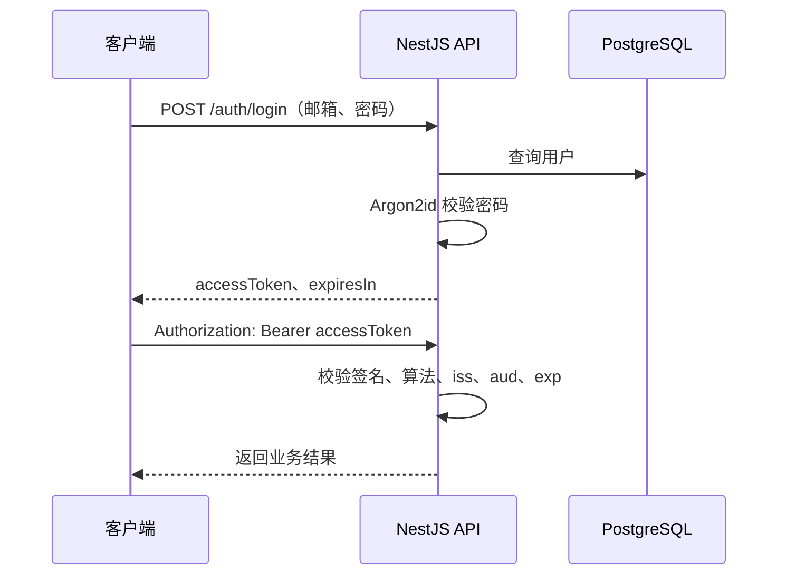

# 纯 Access Token JWT 鉴权方案

一句话方案：用户登录成功后签发一个默认有效期 1 小时的 `access_token`；后续请求只校验 JWT，Token 自然过期后让用户重新登录，服务端不维护任何登录状态。

本文适配当前项目的 NestJS 11、Fastify、Drizzle、PostgreSQL、Argon2id 和 Vite+。

## 1. 固定架构



固定规则如下：

- 只签发 Access Token。
- 默认有效期为 3600 秒。
- Token 唯一的业务声明是 `sub`，值为用户 ID。
- 使用 `Authorization: Bearer <access_token>`。
- Guard 只校验 JWT，不查询 PostgreSQL 或 Redis。
- Token 过期后返回 401，用户重新输入账号密码登录。
- 退出登录只删除客户端 Token，不请求服务端。

本方案明确没有：Refresh Token、Cookie 鉴权、服务端 Session、Token 轮换、版本号、黑名单、踢人、Redis Auth State、L1、Pub/Sub 或 Outbox。

因此必须接受：改密、封号、权限变化和客户端“退出”都不能立即撤销已经签发的 Token；被盗 Token 在 `exp` 前仍然有效。

如果以后必须支持立即失效或长期无感登录，应重新设计鉴权，不要在本方案中逐步塞回版本号、Redis 查询或黑名单。

## 2. HTTP 与 JWT 约定

### 2.1 登录

```http
POST /auth/login
Content-Type: application/json

{
  "email": "alice@example.com",
  "password": "correct horse battery staple"
}
```

Controller 返回：

```json
{
  "accessToken": "eyJ...",
  "tokenType": "Bearer",
  "expiresIn": 3600
}
```

当前项目启用了 `ResponseInterceptor`，实际响应会再包一层统一结构，前端从 `data.accessToken` 取值。

### 2.2 JWT 载荷

```json
{
  "sub": "用户 UUID",
  "iss": "bubbles-server",
  "aud": "bubbles-web",
  "iat": 100,
  "exp": 200
}
```

其中只有 `sub` 是业务代码写入的声明；`iss`、`aud`、`iat` 和 `exp` 由 JWT 配置或 JWT 库生成。

不要加入 `sid`、`authEpoch`、`sessionVersion`、`refreshGeneration` 或 `jti`。没有黑名单时，`jti` 不参与任何判断。

JWT 只有签名，没有加密。载荷中不要放密码、手机号、身份证号或其他敏感信息。

### 2.3 保护接口

```http
GET /auth/me
Authorization: Bearer eyJ...
```

Guard 验证成功后，把 `sub` 映射成：

```json
{
  "userId": "用户 UUID"
}
```

### 2.4 退出和过期

- 主动退出：客户端删除 Token。
- 携带当前 Token 的保护请求返回 401：删除 Token，并跳转登录页。
- 登录接口自身返回 401：只提示账号或密码错误，不触发“登录过期”流程。
- 不调用 refresh 或 logout 接口，因为这两个接口不存在。

## 3. 最小服务端实现

核心只需要以下文件：

```text
apps/server/src/
├─ common/decorators/
│  ├─ public.decorator.ts
│  └─ current-auth.decorator.ts
├─ config/auth.config.ts
└─ modules/auth/
   ├─ guards/access-token.guard.ts
   ├─ auth.types.ts
   ├─ token.service.ts
   ├─ auth.service.ts
   ├─ auth.controller.ts
   └─ auth.module.ts
```

用户查询和密码校验可以复用现有 Repository 与 PasswordService，不需要为了 JWT 再创建 Session Repository。

### 3.1 依赖

只需要：

```powershell
vp add @nestjs/jwt argon2 --filter server --save-catalog --allow-build argon2
```

`@nestjs/jwt` 用于签发和校验 JWT，`argon2` 用于密码 Hash。纯 Bearer JWT 不需要 `@fastify/cookie`。

### 3.2 JWT 配置

创建 `apps/server/src/config/auth.config.ts`：

```ts
import { registerAs } from '@nestjs/config'

export default registerAs('auth', () => {
  const jwtSecret = process.env.JWT_SECRET
  const accessTokenTtlSeconds = Number.parseInt(
    process.env.JWT_ACCESS_TOKEN_TTL_SECONDS ?? '3600',
    10,
  )

  if (!jwtSecret || jwtSecret.length < 32) {
    throw new Error('JWT_SECRET must contain at least 32 characters')
  }

  if (!Number.isSafeInteger(accessTokenTtlSeconds) || accessTokenTtlSeconds <= 0) {
    throw new Error('JWT_ACCESS_TOKEN_TTL_SECONDS must be a positive integer')
  }

  return {
    jwtSecret,
    issuer: process.env.JWT_ISSUER ?? 'bubbles-server',
    audience: process.env.JWT_AUDIENCE ?? 'bubbles-web',
    accessTokenTtlSeconds,
  }
})
```

在 `apps/server/src/config/index.ts` 导出 `authConfig`，并把它放入 `ConfigModule.forRoot()` 的 `load` 数组。

本地环境变量：

```dotenv
JWT_SECRET=请替换成至少32字符的高熵随机密钥
JWT_ISSUER=bubbles-server
JWT_AUDIENCE=bubbles-web
JWT_ACCESS_TOKEN_TTL_SECONDS=3600
```

生成随机密钥：

```powershell
node -e "console.log(require('node:crypto').randomBytes(48).toString('base64'))"
```

真实密钥不能提交到 Git。

### 3.3 类型和 TokenService

创建 `apps/server/src/modules/auth/auth.types.ts`：

```ts
export interface AccessTokenPayload {
  sub: string
}

export interface CurrentAuth {
  userId: string
}
```

创建 `apps/server/src/modules/auth/token.service.ts`：

```ts
import type { AccessTokenPayload } from '@/modules/auth/auth.types'
import { Injectable, UnauthorizedException } from '@nestjs/common'
import { ConfigService } from '@nestjs/config'
import { JwtService } from '@nestjs/jwt'

@Injectable()
export class TokenService {
  private readonly expiresInSeconds: number

  constructor(
    private readonly jwtService: JwtService,
    config: ConfigService,
  ) {
    this.expiresInSeconds = config.getOrThrow<number>('auth.accessTokenTtlSeconds')
  }

  async issueAccessToken(userId: string) {
    const accessToken = await this.jwtService.signAsync({
      sub: userId,
    } satisfies AccessTokenPayload)

    return {
      accessToken,
      tokenType: 'Bearer' as const,
      expiresIn: this.expiresInSeconds,
    }
  }

  async verifyAccessToken(token: string) {
    try {
      const payload = await this.jwtService.verifyAsync<AccessTokenPayload>(token)

      if (typeof payload.sub !== 'string' || payload.sub.length === 0) {
        throw new Error('JWT sub is missing')
      }

      return payload
    } catch {
      throw new UnauthorizedException('登录状态无效或已过期')
    }
  }
}
```

### 3.4 Public、CurrentAuth 和 Guard

`apps/server/src/common/constants/auth.ts` 只保留：

```ts
export const IS_PUBLIC_KEY = Symbol('is_public')
```

创建 `public.decorator.ts`：

```ts
import { IS_PUBLIC_KEY } from '@/common/constants/auth'
import { SetMetadata } from '@nestjs/common'

export const Public = () => SetMetadata(IS_PUBLIC_KEY, true)
```

创建 `current-auth.decorator.ts`：

```ts
import type { CurrentAuth as CurrentAuthValue } from '@/modules/auth/auth.types'
import { createParamDecorator, type ExecutionContext, UnauthorizedException } from '@nestjs/common'
import type { FastifyRequest } from 'fastify'

type AuthenticatedRequest = FastifyRequest & {
  auth?: CurrentAuthValue
}

export const CurrentAuth = createParamDecorator(
  (_data: unknown, context: ExecutionContext): CurrentAuthValue => {
    const request = context.switchToHttp().getRequest<AuthenticatedRequest>()

    if (!request.auth) {
      throw new UnauthorizedException('登录状态不存在')
    }

    return request.auth
  },
)
```

创建 `guards/access-token.guard.ts`：

```ts
import { IS_PUBLIC_KEY } from '@/common/constants/auth'
import type { CurrentAuth } from '@/modules/auth/auth.types'
import { TokenService } from '@/modules/auth/token.service'
import { CanActivate, ExecutionContext, Injectable, UnauthorizedException } from '@nestjs/common'
import { Reflector } from '@nestjs/core'
import type { FastifyRequest } from 'fastify'

type AuthenticatedRequest = FastifyRequest & {
  auth?: CurrentAuth
}

@Injectable()
export class AccessTokenGuard implements CanActivate {
  constructor(
    private readonly reflector: Reflector,
    private readonly tokenService: TokenService,
  ) {}

  async canActivate(context: ExecutionContext) {
    const isPublic = this.reflector.getAllAndOverride<boolean>(IS_PUBLIC_KEY, [
      context.getHandler(),
      context.getClass(),
    ])

    if (isPublic) {
      return true
    }

    const request = context.switchToHttp().getRequest<AuthenticatedRequest>()
    const matched = /^Bearer\s+([^\s]+)$/i.exec(request.headers.authorization ?? '')
    const token = matched?.[1]

    if (!token) {
      throw new UnauthorizedException('缺少有效的 Bearer Token')
    }

    const payload = await this.tokenService.verifyAccessToken(token)
    request.auth = { userId: payload.sub }
    return true
  }
}
```

Guard 不读取用户状态，也不比较任何版本号。

### 3.5 登录接口

用户表只需要 `id`、`email`、`passwordHash` 等普通用户字段。`passwordHash` 应收口为 `NOT NULL`，密码必须使用 Argon2id Hash，不能保存明文。

登录核心逻辑：

```ts
async login(input: LoginDto) {
  const email = input.email.trim().toLowerCase()
  const user = await this.authRepository.findByEmail(email)

  if (!user) {
    throw new UnauthorizedException('邮箱或密码错误')
  }

  const passwordMatches = await this.passwordService.verify(user.passwordHash, input.password)

  if (!passwordMatches) {
    throw new UnauthorizedException('邮箱或密码错误')
  }

  return this.tokenService.issueAccessToken(user.id)
}
```

用户不存在和密码错误使用相同提示。

Controller：

```ts
@ApiTags('认证')
@Controller('auth')
export class AuthController {
  constructor(private readonly authService: AuthService) {}

  @Public()
  @Post('login')
  login(@Body() body: LoginDto) {
    return this.authService.login(body)
  }

  @ApiBearerAuth()
  @Get('me')
  me(@CurrentAuth() auth: CurrentAuthValue) {
    return auth
  }
}
```

注册不是 JWT 的必要组成部分。若项目提供注册接口，只需正常创建用户并保存 Argon2id Hash，不要创建 Session 或 Refresh Token。

### 3.6 AuthModule

```ts
@Module({
  imports: [
    JwtModule.registerAsync({
      inject: [ConfigService],
      useFactory: (config: ConfigService) => {
        const issuer = config.getOrThrow<string>('auth.issuer')
        const audience = config.getOrThrow<string>('auth.audience')

        return {
          secret: config.getOrThrow<string>('auth.jwtSecret'),
          signOptions: {
            algorithm: 'HS256' as const,
            expiresIn: config.getOrThrow<number>('auth.accessTokenTtlSeconds'),
            issuer,
            audience,
          },
          verifyOptions: {
            algorithms: ['HS256' as const],
            issuer,
            audience,
            clockTolerance: 5,
          },
        }
      },
    }),
  ],
  controllers: [AuthController],
  providers: [
    AuthRepository,
    AuthService,
    PasswordService,
    TokenService,
    {
      provide: APP_GUARD,
      useClass: AccessTokenGuard,
    },
  ],
})
export class AuthModule {}
```

把 `AuthModule` 加入 `AppModule.imports`。注册全局 Guard 后，所有公开路由都必须显式添加 `@Public()`。

Swagger 保留 `.addBearerAuth()`；保护接口使用 `@ApiBearerAuth()`。

如果 `@fastify/cookie` 没有其他用途，从 `main.ts` 删除 Cookie 插件注册并移除依赖。

## 4. 前端规则

- 登录后保存 `data.accessToken`。
- 每次保护请求添加 Bearer 请求头。
- 不创建自动刷新定时器。
- 不调用 refresh 接口。
- 携带当前 Token 的保护请求返回 401 时，清理 Token 和用户状态并跳转登录页。
- 主动退出时只清理本地 Token。

最简单可以使用 `sessionStorage`。如果使用 `localStorage` 获得持久化登录，必须接受 XSS 能读取 Token 的风险。

不要把 Token 放进 URL、日志或错误上报。

## 5. 从旧复杂方案收口

如果旧方案还未执行数据库迁移，直接停止继续实现即可。

如果已经落地，收口目标如下：

- 删除 `auth_sessions`、Refresh Token、Refresh Family 和 `auth_outbox` 表。
- 删除 `users.authEpoch`、`passwordChangeAt` 等撤销字段。
- 删除 Refresh Cookie、Auth State、L1、Pub/Sub 和 Outbox 代码。
- 删除 refresh、logout、logout-all、kick 等接口。
- 删除 `AUTH_CONSISTENCY_KEY`、`StrongAuth` 和版本比较。
- Redis 可以保留给其他业务，但鉴权不使用它。

已执行过的旧迁移不要从历史中硬删。生成新的回退迁移，检查 SQL 和数据备份后再执行。

## 6. 验收

开始前和完成后使用 Vite+：

```powershell
vp install
vp run "server#build"
vp check
vp test
```

必须验证：

- 正确账号密码可以获得 Access Token。
- 错误账号或密码返回相同的 401 信息。
- `@Public()` 路由不需要 Token。
- 保护路由缺少 Token 返回 401。
- 有效 Token 可以访问保护路由。
- 篡改、错误签名、错误 `iss`、错误 `aud` 和非 `HS256` Token 返回 401。
- Token 自然过期后返回 401。
- 不存在 refresh、logout 或踢人链路。

生产最低要求：HTTPS、随机强密钥、环境间密钥隔离、登录限流、Argon2id、CORS 白名单、XSS 防护，以及禁止记录密码、JWT 和完整 Authorization 请求头。

## 最终结果

这套架构只有两条运行路径：

1. 登录时查询用户并校验密码，成功后签发默认 1 小时的 Access JWT。
2. 业务请求只校验 JWT；到期或无效就返回 401，让用户重新登录。

除此之外，不维护任何登录状态。
