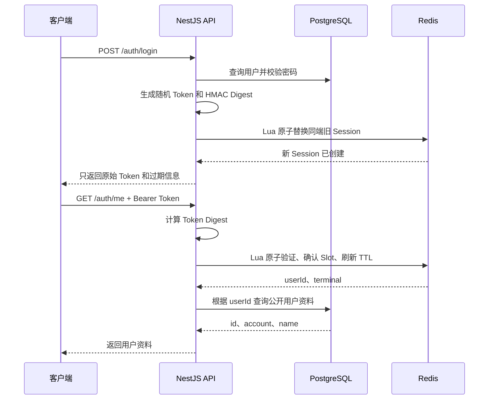

# 从零实现 Redis Session 鉴权

> 目标：不使用 JWT、Refresh Token 或 Cookie。登录成功后返回一个随机 Session Token，前端把它放进 `Authorization` 请求头。每个受保护接口都到 Redis 验证 Session，并刷新滑动 TTL。

这份教程面向前端开发者。每一步都会先解释“为什么”，再给出文件、代码、命令和检查点。

本文适配当前项目：NestJS 11、Fastify、Drizzle、PostgreSQL、ioredis、Argon2id 和 Vite+。

## 最终要得到什么

完成后，登录系统具备以下行为：

- Token 是 32 字节安全随机数，不是 JWT。
- Token 通过 `Authorization: Bearer <token>` 发送。
- Redis 是登录状态的唯一来源。
- 每次有效请求都验证 Redis Session，并刷新空闲 TTL。
- Session 空闲 2 小时后失效。
- Session 最长存在 7 天，持续请求也不能突破绝对期限。
- Web、桌面端、iOS、Android 可以同时登录。
- 正常客户端中，同一个账号在同一种端只能保留最后一次登录。
- 新 Web 登录只替换旧 Web Session，不影响 iOS 或 Android。
- 当前端退出只删除当前端 Session。
- Redis 故障时返回 503，不把故障误报成“用户未登录”。
- 为后续多公司预留清晰边界：`X-Company-Id` 只选择公司，真正接入时必须由后端验证成员和角色。

本文把“一端”定义为逻辑客户端类型：

```text
web | desktop | ios | android
```

Chrome 和 Edge 都属于 `web`。如果同一账号先在 Chrome 登录、再在 Edge 登录，Chrome 的旧 Token 会失效。

这不是“识别一台真实物理设备”。`User-Agent` 请求头也可以被伪造，因此它是产品约束，不是硬件安全边界。浏览器或 App 提供的 `deviceId` 同样可以伪造；真正的设备证明是另一套更复杂的安全系统，不属于本文。

## 先用前端思维理解 Session

JWT 像一张已经盖章的通行证。后端通常只检查通行证是否是真的，不需要查询服务端登录记录。

本教程的 Session Token 更像一张“取件码”：

```text
客户端 Token
    ↓
在 Redis 中找到 Session
    ↓
Session 告诉后端 userId、terminal 和过期时间
```

Token 本身不包含用户数据：

```text
VfN37g4...  ← 只是一串无法猜测的随机字符
```

真正的登录信息在 Redis：

```text
userId = user-123
terminal = web
createdAtMs = 100
lastSeenAtMs = 200
absoluteExpiresAtMs = 300
```

所以服务端可以随时删除 Session，让 Token 立即失效。这正是 Session 相比纯 JWT 更适合“同端互踢”的原因。

## 完整请求流程



## 为什么要有两个 Redis Key

每个登录 Session 使用两个 Key：

```text
auth:v1:session:<tokenDigest>
auth:v1:slot:<userId>:<terminal>
```

第一个 Key 保存 Session 内容：

```text
auth:v1:session:abc123...
```

第二个 Key 表示“这个用户在这个端当前允许使用哪个 Session”：

```text
auth:v1:slot:user-123:web = abc123...
```

如果同一用户重新在 Web 登录，新 Session Digest 会覆盖 Slot：

```text
登录前：auth:v1:slot:user-123:web = old-digest
登录后：auth:v1:slot:user-123:web = new-digest
```

旧 Token 即使对应的 Session Key 暂时还存在，只要 Slot 已经不再指向它，验证也必须失败。

## 为什么 Redis 不保存原始 Token

客户端拿到的是原始 Token：

```text
rawToken = VfN37g4...
```

后端使用服务端 Pepper 计算摘要：

```text
tokenDigest = HMAC-SHA256(SESSION_TOKEN_PEPPER, rawToken)
```

Redis Key 使用 Digest，而不是原始 Token：

```text
auth:v1:session:<tokenDigest>
```

这样即使有人只拿到 Redis 数据，也不能直接把 Redis Key 当成登录 Token 使用。

原始 Token 只会在登录成功时返回一次，不能写进数据库、Redis、日志、URL、埋点或错误上报。

## 两种过期时间

### 空闲期限

推荐 2 小时：

```text
SESSION_IDLE_TTL_SECONDS=7200
```

用户每次发送有效保护请求，Session 都会重新获得最多 2 小时 TTL。

如果用户一直不操作，2 小时后 Session 自动消失。

### 绝对期限

推荐 7 天：

```text
SESSION_ABSOLUTE_TTL_SECONDS=604800
```

无论用户请求多频繁，登录满 7 天后都必须重新登录。

每次请求真正设置的到期时间是：

```text
min(当前 Redis 时间 + 空闲期限, 绝对到期时间)
```

绝对期限不能省略。否则被盗 Token 只要持续发送请求，就可能永远不会过期。

## HTTP 接口约定

### 注册

```http
POST /auth/register
Content-Type: application/json

{
  "name": "Alice",
  "account": "alice_01",
  "password": "correct horse battery staple"
}
```

### 登录

```http
POST /auth/login
Content-Type: application/json
User-Agent: Mozilla/5.0 (Windows NT 10.0; Win64; x64) AppleWebKit/537.36 Chrome/151.0.0.0 Safari/537.36

{
  "account": "alice_01",
  "password": "correct horse battery staple"
}
```

登录 Body 只包含账号和密码。`terminal` 由后端根据浏览器自动携带的 `User-Agent` 判断，前端不需要额外传字段。

上面这段 Windows Chrome 的 `User-Agent` 会识别为 `web`。包含 Android 的 UA 识别为 `android`，包含 iPhone、iPad 或 iPod 的 UA 识别为 `ios`，Electron 或带应用标识的桌面客户端识别为 `desktop`。

浏览器中的 `User-Agent` 由浏览器自动发送，不要在前端 JavaScript 中手工设置。

返回：

```json
{
  "accessToken": "随机 Session Token",
  "tokenType": "Bearer",
  "idleExpiresIn": 7200,
  "absoluteExpiresAt": "2026-08-16T10:00:00.000Z"
}
```

当前项目启用了 `ResponseInterceptor`，实际响应会再包一层统一格式。前端应从 `data.accessToken` 读取 Token。

登录响应故意不返回用户资料。前端保存 Token 后，再调用 `GET /auth/me` 获取当前用户信息。

### 使用 Token 获取当前用户信息

```http
GET /auth/me
Authorization: Bearer <accessToken>
```

返回：

```json
{
  "id": "用户 UUID",
  "account": "alice_01",
  "name": "Alice",
  "terminal": "web"
}
```

实际响应同样会被 `ResponseInterceptor` 包装，前端从 `data` 读取用户对象。`passwordHash`、Token Digest 等内部字段绝不能返回。

### 退出当前端

```http
POST /auth/logout
Authorization: Bearer <accessToken>
```

退出 Web 不影响 iOS、Android 或 Desktop。

## 最终目录

```text
apps/server/src/
├─ common/
│  ├─ constants/
│  │  └─ auth.ts
│  └─ decorators/
│     ├─ public.decorator.ts
│     └─ current-auth.decorator.ts
├─ config/
│  └─ session.config.ts
├─ database/
│  └─ schema.ts
└─ modules/
   └─ auth/
      ├─ dto/
      │  ├─ register.dto.ts
      │  └─ login.dto.ts
      ├─ guards/
      │  └─ session-auth.guard.ts
      ├─ session/
      │  ├─ session.constants.ts
      │  ├─ session.types.ts
      │  ├─ session.scripts.ts
      │  ├─ session-token.service.ts
      │  └─ session-store.service.ts
      ├─ auth.repository.ts
      ├─ password.service.ts
      ├─ auth.service.ts
      ├─ auth.controller.ts
      └─ auth.module.ts
```

# 步骤 0：准备本地环境，并记录当前项目状态

## 本步目标

先让 PostgreSQL、Redis 和环境变量准备好，再记录项目原来的状态。这样后面遇到错误时，能分清是“环境没启动”还是“Session 代码有问题”。

## 0.1 启动 PostgreSQL 和 Redis

项目根目录已经有 `docker-compose.yml`。第一次开始时执行：

```powershell
docker compose up -d postgres redis
docker compose ps
```

`docker compose ps` 中的 `postgres` 和 `redis` 都应处于运行状态。

当前 Compose 的本地连接信息是：

```text
PostgreSQL：localhost:5432
数据库：postgres
用户名：postgres
密码：ml

Redis：localhost:6379
密码：ml
DB：0
```

这些值只适合本地开发。生产环境不能继续使用示例密码。

## 0.2 创建本地环境变量

创建 `apps/server/.env.development.local`：

```dotenv
DATABASE_URL=postgresql://postgres:ml@localhost:5432/postgres
DB_HOST=localhost
DB_PORT=5432
DB_DATABASE=postgres
DB_USERNAME=postgres
DB_PASSWORD=ml

REDIS_HOST=localhost
REDIS_PORT=6379
REDIS_PASSWORD=ml
REDIS_DB=0

SESSION_TOKEN_PEPPER=请在步骤3替换成至少32字符的高熵随机值
SESSION_IDLE_TTL_SECONDS=7200
SESSION_ABSOLUTE_TTL_SECONDS=604800
```

为什么同时存在 `DATABASE_URL` 和 `DB_*`：

- Drizzle 生成、执行迁移时读取 `DATABASE_URL`。
- 当前 NestJS `DatabaseModule` 运行时读取 `DB_*`。

`.env.development.local` 会优先于 `.env.development` 和 `.env` 加载，并且当前 `.gitignore` 的 `*.local` 规则会忽略它。仍然要在提交前用 `git status` 再确认一次，不能把真实 Pepper 提交到 Git。

## 0.3 安装依赖并记录基线

执行：

```powershell
git status --short
vp install
vp run "server#build"
```

当前模板正在清理旧 JWT 方案，可能会看到以下问题：

- `config/index.ts` 仍导出已经删除的 `auth.config.ts`。
- `main.ts` 仍注册 Cookie 插件。
- 数据库 Schema 仍包含 Session、Refresh 和 Outbox 表。
- `pg` 缺少类型声明。

这些会在后续步骤逐一处理。

如果 Vite+ 自身异常，执行：

```powershell
vp env doctor
```

## 完成检查点

- PostgreSQL 和 Redis 容器已经启动。
- `apps/server/.env.development.local` 已配置，并且没有被 Git 跟踪。
- 已保存开始施工前的 `git status`。
- 已执行 `vp install`。
- 已记录构建错误，不覆盖其他用户修改。

# 步骤 1：清理 JWT 和 Cookie 依赖

## 为什么先清理

本方案的 Token 是 Redis Session Token，不需要 JWT 签名，也不通过 Cookie 自动发送。

如果 `@nestjs/jwt` 和 `@fastify/cookie` 没有其他业务用途，可以移除：

```powershell
vp remove @nestjs/jwt @fastify/cookie --filter server
```

项目仍然需要：

- `argon2`：密码 Hash。
- `ioredis`：读取和更新 Redis Session。
- `@nestjs-modules/ioredis`：NestJS Redis 注入。

当前构建还缺少 PostgreSQL 类型时，安装：

```powershell
vp add -D @types/pg --filter server --save-catalog
```

删除 `apps/server/src/main.ts` 中：

```ts
import fastifyCookie from '@fastify/cookie'
```

以及：

```ts
await app.register(fastifyCookie)
```

Swagger 的 Bearer Auth 要保留。Bearer Token 不要求一定是 JWT，随机 Session Token 同样可以使用 Bearer 方案。

## 完成检查点

- 服务端不再依赖 `@nestjs/jwt`。
- 服务端不再依赖 `@fastify/cookie`。
- `main.ts` 不再注册 Cookie 插件。
- `argon2` 和 Redis 依赖仍然存在。

# 步骤 2：简化数据库用户模型

## 为什么 Session 不进 PostgreSQL

本文把 Redis 作为登录状态唯一来源，因此 PostgreSQL 不需要：

- `auth_sessions`
- Refresh Token Family
- Refresh Token
- Auth Outbox
- `authEpoch`
- `sessionVersion`

PostgreSQL 只负责持久化用户、公司、项目和业务数据。

先把 `apps/server/src/database/schema.ts` 中的用户表简化为：

```ts
import { pgEnum, pgTable, timestamp, uuid, varchar } from 'drizzle-orm/pg-core'

export const userStatusEnum = pgEnum('user_status', ['active', 'locked', 'disabled'])

export const users = pgTable('users', {
  id: uuid('id').defaultRandom().primaryKey(),
  name: varchar('name', { length: 100 }).notNull(),
  account: varchar('account', { length: 32 }).notNull().unique(),
  passwordHash: varchar('password_hash', { length: 255 }).notNull(),
  status: userStatusEnum('status').default('active').notNull(),
  createdAt: timestamp('create_at').defaultNow().notNull(),
  updatedAt: timestamp('update_at', { withTimezone: true }).defaultNow().notNull(),
})
```

`account` 是当前唯一登录标识，统一保存为小写，只允许字母、数字和下划线。当前方案不包含邮箱注册、邮箱登录或邮箱找回密码。

如果数据库已经执行过旧迁移，不要删除历史迁移文件。应该生成一个新的迁移来删除旧鉴权表和字段。

如果旧 `users` 表中已经有测试用户和 `email` 列：

- 可以清空的本地测试库：直接按新 Schema 重新生成测试数据最简单。
- 不能清空的数据：先新增可空 `account`，为每个用户回填唯一账号，再改为 `NOT NULL + UNIQUE`，最后才删除旧邮箱列。

不要直接把邮箱值重命名成账号；邮箱中包含 `@` 和点号，不符合这里的账号规则。

```powershell
vp run "server#db:generate"
```

先人工检查生成的 SQL，确认不会误删业务数据，再执行：

```powershell
vp run "server#db:migrate"
```

如果旧用户的 `passwordHash` 还是 `NULL`，必须先完成密码回填或删除测试数据，才能改成 `NOT NULL`。

项目现有 DB 测试接口允许绕过正式注册流程创建用户。正式接入 Auth 后，应删除该写入接口，避免产生没有密码 Hash 的账号。

## 完成检查点

- PostgreSQL 不再保存登录 Session。
- `users.passwordHash` 最终为 `NOT NULL`。
- 用户状态仍保留，用于禁止 locked 或 disabled 用户登录。
- 已检查数据库迁移 SQL。

# 步骤 3：新增 Session 配置

## 为什么配置要集中管理

Token Pepper 和 TTL 都属于安全配置。散落在代码里的数字很难检查，也容易让不同环境行为不一致。

创建 `apps/server/src/config/session.config.ts`：

```ts
import { registerAs } from '@nestjs/config'

function readPositiveInteger(name: string, fallback: number) {
  const value = Number.parseInt(process.env[name] ?? String(fallback), 10)

  if (!Number.isSafeInteger(value) || value <= 0) {
    throw new Error(`${name} must be a positive integer`)
  }

  return value
}

export default registerAs('session', () => {
  const tokenPepper = process.env.SESSION_TOKEN_PEPPER
  const idleTtlSeconds = readPositiveInteger('SESSION_IDLE_TTL_SECONDS', 7200)
  const absoluteTtlSeconds = readPositiveInteger('SESSION_ABSOLUTE_TTL_SECONDS', 604800)

  if (!tokenPepper || tokenPepper.length < 32) {
    throw new Error('SESSION_TOKEN_PEPPER must contain at least 32 characters')
  }

  if (absoluteTtlSeconds <= idleTtlSeconds) {
    throw new Error('SESSION_ABSOLUTE_TTL_SECONDS must be greater than idle TTL')
  }

  return {
    tokenPepper,
    idleTtlMs: idleTtlSeconds * 1000,
    absoluteTtlMs: absoluteTtlSeconds * 1000,
  }
})
```

修改 `apps/server/src/config/index.ts`：

```ts
export { default as appConfig } from './app.config'
export { default as databaseConfig } from './database.config'
export { default as llmConfig } from './llm.config'
export { default as redisConfig } from './redis.config'
export { default as sessionConfig } from './session.config'
```

删除旧的：

```ts
export { default as authConfig } from './auth.config'
```

在本地环境文件中配置：

```dotenv
SESSION_TOKEN_PEPPER=请替换成至少32字符的高熵随机值
SESSION_IDLE_TTL_SECONDS=7200
SESSION_ABSOLUTE_TTL_SECONDS=604800
```

生成 Pepper：

```powershell
node -e "console.log(require('node:crypto').randomBytes(48).toString('base64'))"
```

Pepper 不能提交到 Git。以后更换 Pepper 会导致所有旧 Token 无法计算出原 Digest，相当于强制全部用户退出。

## 完成检查点

- 启动时会验证 Pepper 和 TTL。
- 绝对期限大于空闲期限。
- 本地密钥文件没有被 Git 跟踪。

# 步骤 4：定义 Terminal、Redis Key 和类型

## 为什么 Terminal 必须是固定枚举

如果客户端可以随意传入任意字符串：

```text
web-1
web-2
web-3
```

它就能绕过“同一端只能登录一次”的限制。

因此只允许服务端定义好的类型。

创建 `apps/server/src/modules/auth/session/session.constants.ts`：

```ts
export const SESSION_TERMINALS = ['web', 'desktop', 'ios', 'android'] as const

export type SessionTerminal = (typeof SESSION_TERMINALS)[number]

export const SESSION_KEY_PREFIX = 'auth:v1:session:'
export const SESSION_SLOT_PREFIX = 'auth:v1:slot:'

export function createSessionKey(tokenDigest: string) {
  return `${SESSION_KEY_PREFIX}${tokenDigest}`
}

export function createSessionSlotKey(userId: string, terminal: SessionTerminal) {
  return `${SESSION_SLOT_PREFIX}${userId}:${terminal}`
}

export function isSessionTerminal(value: string): value is SessionTerminal {
  return SESSION_TERMINALS.includes(value as SessionTerminal)
}

export function detectSessionTerminal(userAgent: string | undefined): SessionTerminal {
  const value = userAgent ?? ''

  if (/\bBubblesDesktop\//i.test(value) || /\bElectron\//i.test(value)) {
    return 'desktop'
  }

  if (/\bBubblesIOS\//i.test(value) || /iPhone|iPad|iPod/i.test(value)) {
    return 'ios'
  }

  if (/\bBubblesAndroid\//i.test(value) || /Android/i.test(value)) {
    return 'android'
  }

  return 'web'
}
```

创建 `apps/server/src/modules/auth/session/session.types.ts`：

```ts
import type { FastifyRequest } from 'fastify'
import type { SessionTerminal } from './session.constants'

export interface CurrentAuth {
  userId: string
  terminal: SessionTerminal
}

export type AuthenticatedRequest = FastifyRequest & {
  auth?: CurrentAuth
}

export interface CreateSessionInput {
  tokenDigest: string
  userId: string
  terminal: SessionTerminal
  loginIp: string
  userAgent: string
}

export interface CreatedSession {
  initialExpiresAtMs: number
  absoluteExpiresAtMs: number
}
```

Session Digest 不进入通用请求上下文。退出接口会从自己的 Authorization Header 重新计算 Digest。

## 完成检查点

- Terminal 只有四个固定值。
- 登录根据 `User-Agent` 识别 Terminal，登录 Body 不接收 Terminal。
- Redis Key 都由统一函数生成。
- Controller 不会直接拼 Redis Key。

# 步骤 5：生成随机 Token 和 Digest

## 本步目标

生成客户端真正持有的 Token，并计算 Redis 使用的安全摘要。

创建 `apps/server/src/modules/auth/session/session-token.service.ts`：

```ts
import { createHmac, randomBytes } from 'node:crypto'
import { Injectable } from '@nestjs/common'
import { ConfigService } from '@nestjs/config'

@Injectable()
export class SessionTokenService {
  private readonly tokenPepper: string

  constructor(config: ConfigService) {
    this.tokenPepper = config.getOrThrow<string>('session.tokenPepper')
  }

  createToken() {
    const rawToken = randomBytes(32).toString('base64url')

    return {
      rawToken,
      tokenDigest: this.digest(rawToken),
    }
  }

  digest(rawToken: string) {
    return createHmac('sha256', this.tokenPepper).update(rawToken).digest('hex')
  }

  extractBearerToken(authorization: string | undefined) {
    const matched = /^Bearer\s+([A-Za-z0-9_-]{43})$/i.exec(authorization ?? '')
    return matched?.[1] ?? null
  }
}
```

`randomBytes(32)` 产生 256 bit 随机数据。base64url 编码后通常是 43 个字符，只包含适合放在 Header 中的字符。

为什么不使用用户 ID、时间戳或 UUID 自己拼 Token：

- 用户 ID 可以猜测。
- 时间戳可以猜测。
- 普通 UUID 虽然通常够用，但 32 字节安全随机数更直接。
- Session Token 必须不可预测，而不只是“不重复”。

## 完成检查点

- 原始 Token 只返回给客户端。
- Redis 只使用 64 字符十六进制 Digest。
- Pepper 只来自服务端环境变量。
- 日志中不打印 Token 或 Digest。

# 步骤 6：理解为什么必须使用 Lua

## 如果用普通 Redis 命令会发生什么

假设旧 Web 请求正在续期，同时用户在另一个浏览器重新登录：

```text
请求 A：读取旧 Session，判断有效
登录 B：删除旧 Session，创建新 Session
请求 A：对旧 Session 执行 EXPIRE
```

如果请求 A 的代码还会重新写 Session，它可能把已经失效的旧登录复活。

Redis Lua 脚本执行期间，其他 Redis 命令不能插进脚本中间。我们把“读取、判断、更新”放在一个脚本里，就能获得原子性。

本文需要三个请求核心脚本：

1. 登录并替换同端旧 Session。
2. 验证 Session 并刷新 TTL。
3. 退出当前 Session。

账号被锁定、禁用或修改密码时，还需要第四个管理脚本：一次撤销该用户四种 Terminal 的全部 Session。它不是每个请求都会执行，但能避免旧 Session 一直使用到 7 天绝对期限。

当前项目使用单实例 Redis，因此脚本可以根据 Session 中的 `userId` 和 `terminal` 动态构造 Slot Key。如果以后迁移 Redis Cluster，需要重新设计 Key 的 Hash Slot，不能直接照搬。

先不要急着看完整 Lua。四个事务的伪代码分别是：

```text
登录：
  读取当前端 Slot
  创建新 Session
  Slot 指向新 Session
  删除旧 Session

验证：
  读取 Session
  确认 Slot 仍指向它
  检查绝对期限
  更新 lastSeen
  把两个 Key 续期到同一个时间点

退出：
  读取 Session
  只有 Slot 仍指向自己时才删除 Slot
  删除当前 Session

撤销全部：
  读取固定四种 Terminal 的 Slot
  删除每个 Slot 指向的 Session
  删除四个 Slot
```

先理解上面的四段，再阅读下面完整脚本。Lua 只是把这些步骤放进 Redis 内一次完成。

# 步骤 7：编写四个原子 Lua 脚本

## 为什么把 Lua 放进 TypeScript

如果使用独立 `.lua` 文件，还需要配置 Nest 构建时复制静态资源。为了让教程更容易施工，这里把脚本保存为 TypeScript 字符串常量。

创建 `apps/server/src/modules/auth/session/session.scripts.ts`：

```ts
export const CREATE_OR_REPLACE_SESSION_SCRIPT = String.raw`
local function isValidTerminal(value)
  return value == 'web' or value == 'desktop' or value == 'ios' or value == 'android'
end

local function isValidUserId(value)
  return string.len(value) > 0
    and string.len(value) <= 100
    and string.match(value, '^[%w_-]+$') ~= nil
end

local newDigest = ARGV[1]
local userId = ARGV[2]
local terminal = ARGV[3]
local idleTtlMs = tonumber(ARGV[4])
local absoluteTtlMs = tonumber(ARGV[5])
local sessionKeyPrefix = ARGV[6]
local loginIp = ARGV[7]
local userAgent = ARGV[8]

if newDigest == '' or not isValidUserId(userId) or not isValidTerminal(terminal) then
  return { 0, 'INVALID_ARGUMENT' }
end

if not idleTtlMs or not absoluteTtlMs or idleTtlMs <= 0 or absoluteTtlMs <= idleTtlMs then
  return { 0, 'INVALID_TTL' }
end

local redisTime = redis.call('TIME')
local nowMs = tonumber(redisTime[1]) * 1000 + math.floor(tonumber(redisTime[2]) / 1000)
local absoluteExpiresAtMs = nowMs + absoluteTtlMs
local initialExpiresAtMs = math.min(nowMs + idleTtlMs, absoluteExpiresAtMs)
local oldDigest = redis.call('GET', KEYS[1])

redis.call(
  'HSET',
  KEYS[2],
  'userId', userId,
  'terminal', terminal,
  'createdAtMs', tostring(nowMs),
  'lastSeenAtMs', tostring(nowMs),
  'absoluteExpiresAtMs', tostring(absoluteExpiresAtMs),
  'loginIp', loginIp,
  'userAgent', userAgent
)

redis.call('PEXPIREAT', KEYS[2], initialExpiresAtMs)
redis.call('SET', KEYS[1], newDigest)
redis.call('PEXPIREAT', KEYS[1], initialExpiresAtMs)

if oldDigest and oldDigest ~= newDigest then
  redis.call('DEL', sessionKeyPrefix .. oldDigest)
end

return {
  1,
  oldDigest or '',
  tostring(initialExpiresAtMs),
  tostring(absoluteExpiresAtMs)
}
`

export const VALIDATE_AND_TOUCH_SESSION_SCRIPT = String.raw`
local function isValidTerminal(value)
  return value == 'web' or value == 'desktop' or value == 'ios' or value == 'android'
end

local function isValidUserId(value)
  return string.len(value) > 0
    and string.len(value) <= 100
    and string.match(value, '^[%w_-]+$') ~= nil
end

local currentDigest = ARGV[1]
local slotKeyPrefix = ARGV[2]
local idleTtlMs = tonumber(ARGV[3])

if currentDigest == '' or not idleTtlMs or idleTtlMs <= 0 then
  return { 0, 'INVALID_ARGUMENT' }
end

local sessionValues = redis.call(
  'HMGET',
  KEYS[1],
  'userId',
  'terminal',
  'absoluteExpiresAtMs'
)

local userId = sessionValues[1]
local terminal = sessionValues[2]
local absoluteExpiresAtMs = tonumber(sessionValues[3])

if not userId or not terminal or not absoluteExpiresAtMs then
  return { 0, 'NOT_FOUND' }
end

if not isValidUserId(userId) or not isValidTerminal(terminal) then
  return { 0, 'INVALID_SESSION_DATA' }
end

local slotKey = slotKeyPrefix .. userId .. ':' .. terminal
local slotDigest = redis.call('GET', slotKey)

if slotDigest ~= currentDigest then
  redis.call('DEL', KEYS[1])
  return { 0, 'REPLACED' }
end

local redisTime = redis.call('TIME')
local nowMs = tonumber(redisTime[1]) * 1000 + math.floor(tonumber(redisTime[2]) / 1000)

if nowMs >= absoluteExpiresAtMs then
  redis.call('DEL', KEYS[1])
  redis.call('DEL', slotKey)
  return { 0, 'ABSOLUTE_EXPIRED' }
end

local expiresAtMs = math.min(nowMs + idleTtlMs, absoluteExpiresAtMs)
redis.call('HSET', KEYS[1], 'lastSeenAtMs', tostring(nowMs))
redis.call('PEXPIREAT', KEYS[1], expiresAtMs)
redis.call('PEXPIREAT', slotKey, expiresAtMs)

return {
  1,
  userId,
  terminal,
  tostring(expiresAtMs)
}
`

export const LOGOUT_SESSION_SCRIPT = String.raw`
local function isValidTerminal(value)
  return value == 'web' or value == 'desktop' or value == 'ios' or value == 'android'
end

local function isValidUserId(value)
  return string.len(value) > 0
    and string.len(value) <= 100
    and string.match(value, '^[%w_-]+$') ~= nil
end

local currentDigest = ARGV[1]
local slotKeyPrefix = ARGV[2]

local sessionValues = redis.call(
  'HMGET',
  KEYS[1],
  'userId',
  'terminal'
)

local userId = sessionValues[1]
local terminal = sessionValues[2]

if not userId or not terminal then
  return { 1, 'ALREADY_GONE' }
end

if not isValidUserId(userId) or not isValidTerminal(terminal) then
  return { 0, 'INVALID_SESSION_DATA' }
end

local slotKey = slotKeyPrefix .. userId .. ':' .. terminal
local slotDigest = redis.call('GET', slotKey)

if slotDigest == currentDigest then
  redis.call('DEL', slotKey)
end

redis.call('DEL', KEYS[1])

return { 1, 'LOGGED_OUT' }
`

export const REVOKE_USER_SESSIONS_SCRIPT = String.raw`
local sessionKeyPrefix = ARGV[1]
local revokedCount = 0

for index = 1, #KEYS do
  local digest = redis.call('GET', KEYS[index])

  if digest
    and string.len(digest) == 64
    and string.match(digest, '^[0-9a-f]+$') ~= nil then
    redis.call('DEL', sessionKeyPrefix .. digest)
    revokedCount = revokedCount + 1
  end

  redis.call('DEL', KEYS[index])
end

return { 1, tostring(revokedCount) }
`
```

## 脚本 1：登录并替换同端 Session

传入：

```text
KEYS[1] = 当前 userId + terminal 的 Slot Key
KEYS[2] = 新 Session Key

ARGV[1] = 新 Token Digest
ARGV[2] = userId
ARGV[3] = terminal
ARGV[4] = idleTtlMs
ARGV[5] = absoluteTtlMs
ARGV[6] = Session Key 前缀
ARGV[7] = 登录 IP
ARGV[8] = User-Agent
```

执行结果：

- 创建新 Session。
- Slot 指向新 Digest。
- 删除同端旧 Session。
- 不修改其他 Terminal 的 Slot。

所有参数检查必须放在写入 Redis 之前。Redis Lua 是原子的，但脚本执行到一半报错时，不会自动回滚已经执行的写操作。

## 脚本 2：验证并续期

它完成：

1. 根据 Digest 找到 Session。
2. 从 Session 读取 `userId` 和 `terminal`。
3. 构造 Slot Key。
4. 确认 Slot 仍指向当前 Digest。
5. 检查绝对期限。
6. 更新 `lastSeenAtMs`。
7. 同时刷新 Session 与 Slot 的 TTL。

使用 Redis 的 `TIME`，而不是 NestJS 进程的 `Date.now()`，可以避免多个服务实例系统时钟略有不同。

## 脚本 3：退出当前 Session

退出时只有在 Slot 仍指向当前 Digest 时才删除 Slot。

这是为了防止下面的竞态：

```text
旧 Web Token 已被新 Web 登录替换
旧页面稍后调用 logout
```

如果旧 logout 无条件删除 Web Slot，就会把新登录也一起退出。

## 脚本 4：撤销用户的全部 Session

调用方把固定的四个 Slot Key 作为 `KEYS` 传入：

```text
auth:v1:slot:<userId>:web
auth:v1:slot:<userId>:desktop
auth:v1:slot:<userId>:ios
auth:v1:slot:<userId>:android
```

脚本逐个读取 Slot 指向的 Digest，然后同时删除对应 Session Key 和 Slot Key。它用于：

- 管理员锁定或禁用账号。
- 用户修改密码后强制所有端重新登录。
- 安全事件中手工撤销某个用户的全部登录状态。

不要使用 `KEYS auth:v1:session:*` 扫描生产 Redis。按固定 Terminal 删除的成本稳定，也不会阻塞整个 Redis。

## 完成检查点

- 四个脚本中的读取、判断和写入不可拆开。
- 失败验证不会刷新 TTL。
- 请求不会把已删除 Session 重新写成 active。
- logout 不会删除同端新 Session。
- 可以按用户一次撤销四种 Terminal 的 Session。

# 步骤 8：实现 SessionStoreService

## 这个 Service 做什么

`SessionStoreService` 是 NestJS 与 Redis Lua 之间的适配层：

- 负责生成 Redis Key。
- 调用 Lua。
- 把 Lua 数组转换成 TypeScript 对象。
- Redis 故障时统一抛出 503。
- Session 无效时返回 `null`，交给 Guard 转成 401。
- 账号状态变化时撤销该用户全部 Terminal 的 Session。

创建 `apps/server/src/modules/auth/session/session-store.service.ts`：

```ts
import { InjectRedis } from '@nestjs-modules/ioredis'
import { Injectable, Logger, ServiceUnavailableException } from '@nestjs/common'
import { ConfigService } from '@nestjs/config'
import Redis from 'ioredis'
import {
  createSessionKey,
  createSessionSlotKey,
  isSessionTerminal,
  SESSION_KEY_PREFIX,
  SESSION_SLOT_PREFIX,
  SESSION_TERMINALS,
} from './session.constants'
import {
  CREATE_OR_REPLACE_SESSION_SCRIPT,
  LOGOUT_SESSION_SCRIPT,
  REVOKE_USER_SESSIONS_SCRIPT,
  VALIDATE_AND_TOUCH_SESSION_SCRIPT,
} from './session.scripts'
import type { CreateSessionInput, CreatedSession, CurrentAuth } from './session.types'

type SessionRedis = Redis & {
  authCreateOrReplaceSession(...args: string[]): Promise<unknown>
  authValidateAndTouchSession(...args: string[]): Promise<unknown>
  authLogoutSession(...args: string[]): Promise<unknown>
  authRevokeUserSessions(...args: string[]): Promise<unknown>
}

const INVALID_SESSION_CODES = new Set(['NOT_FOUND', 'REPLACED', 'ABSOLUTE_EXPIRED'])

@Injectable()
export class SessionStoreService {
  private readonly logger = new Logger(SessionStoreService.name)
  private readonly redis: SessionRedis
  private readonly idleTtlMs: number
  private readonly absoluteTtlMs: number

  constructor(@InjectRedis() redis: Redis, config: ConfigService) {
    this.redis = redis as SessionRedis
    this.idleTtlMs = config.getOrThrow<number>('session.idleTtlMs')
    this.absoluteTtlMs = config.getOrThrow<number>('session.absoluteTtlMs')

    this.redis.defineCommand('authCreateOrReplaceSession', {
      numberOfKeys: 2,
      lua: CREATE_OR_REPLACE_SESSION_SCRIPT,
    })

    this.redis.defineCommand('authValidateAndTouchSession', {
      numberOfKeys: 1,
      lua: VALIDATE_AND_TOUCH_SESSION_SCRIPT,
    })

    this.redis.defineCommand('authLogoutSession', {
      numberOfKeys: 1,
      lua: LOGOUT_SESSION_SCRIPT,
    })

    this.redis.defineCommand('authRevokeUserSessions', {
      numberOfKeys: SESSION_TERMINALS.length,
      lua: REVOKE_USER_SESSIONS_SCRIPT,
    })
  }

  async createOrReplace(input: CreateSessionInput): Promise<CreatedSession> {
    const result = await this.execute(() =>
      this.redis.authCreateOrReplaceSession(
        createSessionSlotKey(input.userId, input.terminal),
        createSessionKey(input.tokenDigest),
        input.tokenDigest,
        input.userId,
        input.terminal,
        String(this.idleTtlMs),
        String(this.absoluteTtlMs),
        SESSION_KEY_PREFIX,
        input.loginIp,
        input.userAgent,
      ),
    )

    if (result[0] !== '1') {
      this.logger.error(`Create session script rejected: ${result[1] ?? 'UNKNOWN'}`)
      throw new ServiceUnavailableException('暂时无法创建登录状态')
    }

    const initialExpiresAtMs = Number(result[2])
    const absoluteExpiresAtMs = Number(result[3])

    if (!Number.isFinite(initialExpiresAtMs) || !Number.isFinite(absoluteExpiresAtMs)) {
      throw new ServiceUnavailableException('登录状态数据异常')
    }

    return {
      initialExpiresAtMs,
      absoluteExpiresAtMs,
    }
  }

  async validateAndTouch(tokenDigest: string): Promise<CurrentAuth | null> {
    const result = await this.execute(() =>
      this.redis.authValidateAndTouchSession(
        createSessionKey(tokenDigest),
        tokenDigest,
        SESSION_SLOT_PREFIX,
        String(this.idleTtlMs),
      ),
    )

    if (result[0] !== '1') {
      const code = result[1] ?? 'UNKNOWN'

      if (INVALID_SESSION_CODES.has(code)) {
        return null
      }

      this.logger.error(`Validate session script returned unexpected code: ${code}`)
      throw new ServiceUnavailableException('登录状态数据异常')
    }

    const userId = result[1]
    const terminal = result[2]

    if (!userId || !terminal || !isSessionTerminal(terminal)) {
      this.logger.error('Redis returned an invalid Session payload')
      throw new ServiceUnavailableException('登录状态数据异常')
    }

    return {
      userId,
      terminal,
    }
  }

  async logout(tokenDigest: string) {
    const result = await this.execute(() =>
      this.redis.authLogoutSession(createSessionKey(tokenDigest), tokenDigest, SESSION_SLOT_PREFIX),
    )

    if (result[0] !== '1') {
      this.logger.error(`Logout session script returned unexpected code: ${result[1] ?? 'UNKNOWN'}`)
      throw new ServiceUnavailableException('暂时无法完成退出')
    }
  }

  async revokeAllForUser(userId: string) {
    const slotKeys = SESSION_TERMINALS.map((terminal) => createSessionSlotKey(userId, terminal))
    const result = await this.execute(() =>
      this.redis.authRevokeUserSessions(...slotKeys, SESSION_KEY_PREFIX),
    )

    if (result[0] !== '1') {
      this.logger.error(
        `Revoke user sessions script returned unexpected code: ${result[1] ?? 'UNKNOWN'}`,
      )
      throw new ServiceUnavailableException('暂时无法撤销用户登录状态')
    }
  }

  private async execute(command: () => Promise<unknown>) {
    try {
      const result = await command()

      if (!Array.isArray(result)) {
        throw new Error('Redis script returned a non-array result')
      }

      return result.map((item) => String(item ?? ''))
    } catch (error) {
      const stack = error instanceof Error ? error.stack : undefined
      this.logger.error('Redis Session command failed', stack)

      throw new ServiceUnavailableException({
        code: 'AUTH_SERVICE_UNAVAILABLE',
        message: '登录服务暂时不可用，请稍后重试',
      })
    }
  }
}
```

这里使用 `ioredis.defineCommand()`，而不是在每个请求中调用 `EVAL` 并重新发送完整 Lua 文本。ioredis 会优先使用脚本 SHA 执行，并在 Redis 尚未加载脚本时自动回退加载，适合每个保护请求都会调用的高频脚本。

## 401 和 503 为什么必须区分

Session 不存在、过期、退出或被同端新登录替换：

```text
401 Unauthorized
```

Redis 断线、超时或脚本执行失败：

```text
503 Service Unavailable
```

前端收到 401 应清理 Token；收到 503 应保留 Token并提示稍后重试。

如果把 Redis 故障也返回成 401，一次 Redis 抖动会导致所有客户端错误地清空登录状态。

## 完成检查点

- 所有 Session Redis 操作都从一个 Service 进入。
- 业务 Service 不直接执行 `GET`、`HGET` 或 `EXPIRE`。
- Redis 故障统一返回 503。
- 无效 Session 由 Guard 转成 401。
- 锁定、禁用和改密流程可以调用 `revokeAllForUser()`。

# 步骤 9：实现密码、DTO 和用户 Repository

## 9.1 PasswordService

密码不能加密后保存，也不能直接保存明文。正确方式是使用专门的密码 Hash 算法。

创建 `apps/server/src/modules/auth/password.service.ts`：

```ts
import { Injectable } from '@nestjs/common'
import * as argon2 from 'argon2'

@Injectable()
export class PasswordService {
  hash(password: string) {
    return argon2.hash(password, {
      type: argon2.argon2id,
    })
  }

  async verify(passwordHash: string, password: string) {
    try {
      return await argon2.verify(passwordHash, password)
    } catch {
      return false
    }
  }
}
```

Argon2id 会自动在 Hash 中保存 Salt 和算法参数，因此不需要额外创建 Salt 字段。

## 9.2 RegisterDto

创建 `apps/server/src/modules/auth/dto/register.dto.ts`：

```ts
import { createZodDto } from 'nestjs-zod'
import { z } from 'zod'

export const registerSchema = z.object({
  name: z.string().trim().min(2).max(100),
  account: z
    .string()
    .trim()
    .min(4)
    .max(32)
    .regex(/^[A-Za-z0-9_]+$/, '账号只能包含字母、数字和下划线'),
  password: z.string().min(8).max(128),
})

export class RegisterDto extends createZodDto(registerSchema) {}
```

## 9.3 LoginDto

创建 `apps/server/src/modules/auth/dto/login.dto.ts`：

```ts
import { createZodDto } from 'nestjs-zod'
import { z } from 'zod'

export const loginSchema = z.object({
  account: z
    .string()
    .trim()
    .min(4)
    .max(32)
    .regex(/^[A-Za-z0-9_]+$/, '账号格式错误'),
  password: z.string().min(1).max(128),
})

export class LoginDto extends createZodDto(loginSchema) {}
```

账号规则保持简单：

- 4～32 个字符。
- 只允许字母、数字和下划线。
- 注册和登录进入 Service 后统一转成小写。
- `Alice_01` 和 `alice_01` 视为同一个账号。

`LoginDto` 故意没有 `terminal`。客户端类型从请求自带的 `User-Agent` 推导，不放在 Body 中。

普通 Web 项目什么都不用额外设置：

```ts
await login(account, password)
// 浏览器自动发送 User-Agent，后端识别为 web。
```

原生客户端需要在自己的网络层追加稳定的应用标识，例如：

```text
BubblesDesktop/1.0
BubblesIOS/1.0
BubblesAndroid/1.0
```

可以把这个标识追加在原有 User-Agent 后面。当前规则会把 iPhone/iPad 浏览器归到 `ios`，把 Android 浏览器归到 `android`；也就是说，同一账号的移动浏览器和同平台原生 App 共用一个 Slot。如果以后希望它们分别在线，再增加明确的 `mobile_web` 类型，不要用越来越复杂的 UA 猜测硬凑。

User-Agent 可以伪造，因此这仍然只是正常客户端之间的产品规则，不能证明真实设备身份。

## 9.4 AuthRepository

创建 `apps/server/src/modules/auth/auth.repository.ts`：

```ts
import { DRIZZLE, type DrizzleDB } from '@/database/db.module'
import { users } from '@/database/schema'
import { Inject, Injectable } from '@nestjs/common'
import { eq } from 'drizzle-orm'

type CreateUserInput = Pick<typeof users.$inferInsert, 'name' | 'account' | 'passwordHash'>

@Injectable()
export class AuthRepository {
  constructor(@Inject(DRIZZLE) private readonly db: DrizzleDB) {}

  async findByAccount(account: string) {
    const [user] = await this.db.select().from(users).where(eq(users.account, account)).limit(1)
    return user ?? null
  }

  async findPublicById(userId: string) {
    const [user] = await this.db
      .select({
        id: users.id,
        account: users.account,
        name: users.name,
        status: users.status,
      })
      .from(users)
      .where(eq(users.id, userId))
      .limit(1)

    return user ?? null
  }

  async createUser(input: CreateUserInput) {
    const [user] = await this.db
      .insert(users)
      .values(input)
      .onConflictDoNothing({ target: users.account })
      .returning()

    return user ?? null
  }
}
```

`.onConflictDoNothing()` 用于处理两个相同账号注册请求并发到达的情况。仅在 Service 中先查询账号仍然存在竞态，数据库唯一约束才是最终防线。

## 完成检查点

- 数据库只保存 Argon2id Hash。
- 登录 DTO 只包含账号和密码，不包含 Terminal。
- 服务端只把 User-Agent 识别成四种固定 Terminal。
- 账号只允许字母、数字和下划线，并由 Service 统一转成小写。
- `findPublicById()` 显式选择公开字段，不会把 `passwordHash` 返回给 `/auth/me`。

# 步骤 10：实现 AuthService

## 登录时发生什么

登录不是“生成 Token”这么简单，它的顺序必须是：

```text
查询用户
  ↓
检查账号状态
  ↓
校验密码
  ↓
生成随机 Token
  ↓
Redis 原子创建 Session
  ↓
返回 Token
```

只有 Redis 创建 Session 成功后，才能把 Token 返回前端。否则前端会拿到一个永远无法验证的 Token。

创建 `apps/server/src/modules/auth/auth.service.ts`：

```ts
import {
  ConflictException,
  Injectable,
  ServiceUnavailableException,
  UnauthorizedException,
} from '@nestjs/common'
import { ConfigService } from '@nestjs/config'
import { AuthRepository } from './auth.repository'
import type { LoginDto } from './dto/login.dto'
import type { RegisterDto } from './dto/register.dto'
import { PasswordService } from './password.service'
import { detectSessionTerminal } from './session/session.constants'
import { SessionStoreService } from './session/session-store.service'
import { SessionTokenService } from './session/session-token.service'

interface LoginMetadata {
  ip: string
  userAgent: string
}

@Injectable()
export class AuthService {
  private readonly idleExpiresIn: number

  constructor(
    private readonly authRepository: AuthRepository,
    private readonly passwordService: PasswordService,
    private readonly sessionTokenService: SessionTokenService,
    private readonly sessionStoreService: SessionStoreService,
    config: ConfigService,
  ) {
    this.idleExpiresIn = Math.floor(config.getOrThrow<number>('session.idleTtlMs') / 1000)
  }

  async register(input: RegisterDto) {
    const account = input.account.trim().toLowerCase()
    const passwordHash = await this.passwordService.hash(input.password)
    const user = await this.authRepository.createUser({
      name: input.name.trim(),
      account,
      passwordHash,
    })

    if (!user) {
      throw new ConflictException('账号已存在')
    }

    return {
      id: user.id,
      name: user.name,
      account: user.account,
    }
  }

  async login(input: LoginDto, metadata: LoginMetadata) {
    const account = input.account.trim().toLowerCase()
    const user = await this.authRepository.findByAccount(account)

    if (!user || user.status !== 'active') {
      throw new UnauthorizedException('账号或密码错误')
    }

    const passwordMatches = await this.passwordService.verify(user.passwordHash, input.password)

    if (!passwordMatches) {
      throw new UnauthorizedException('账号或密码错误')
    }

    const { rawToken, tokenDigest } = this.sessionTokenService.createToken()
    const session = await this.sessionStoreService.createOrReplace({
      tokenDigest,
      userId: user.id,
      terminal: detectSessionTerminal(metadata.userAgent),
      loginIp: metadata.ip.slice(0, 64),
      userAgent: metadata.userAgent.slice(0, 500),
    })

    return {
      accessToken: rawToken,
      tokenType: 'Bearer' as const,
      idleExpiresIn: this.idleExpiresIn,
      absoluteExpiresAt: new Date(session.absoluteExpiresAtMs).toISOString(),
    }
  }

  async getCurrentUser(userId: string) {
    const user = await this.authRepository.findPublicById(userId).catch(() => {
      throw new ServiceUnavailableException({
        code: 'USER_SERVICE_UNAVAILABLE',
        message: '暂时无法获取用户信息，请稍后重试',
      })
    })

    if (!user || user.status !== 'active') {
      throw new UnauthorizedException({
        code: 'SESSION_USER_INVALID',
        message: '用户不存在或账号已不可用，请重新登录',
      })
    }

    return {
      id: user.id,
      account: user.account,
      name: user.name,
    }
  }

  async logout(authorization: string | undefined) {
    const rawToken = this.sessionTokenService.extractBearerToken(authorization)

    if (!rawToken) {
      return { loggedOut: true }
    }

    const tokenDigest = this.sessionTokenService.digest(rawToken)
    await this.sessionStoreService.logout(tokenDigest)
    return { loggedOut: true }
  }
}
```

用户不存在、账号不可用和密码错误使用相同登录错误，避免直接告诉攻击者某个账号是否存在。

生产环境还应对登录接口增加限流，例如按 IP 和账号组合限制失败次数。限流和验证码属于登录防爆破，不属于 Session 核心，因此本文先不展开。

## 10.1 账号锁定、禁用和改密后怎么办

只在登录时检查 `users.status` 是不够的。用户已经登录后，Guard 不会每次再查询 PostgreSQL；如果什么都不做，旧 Session 最长还能继续使用 7 天。

第一版采用明确的撤销规则：

| 事件           | 数据库操作          | Redis 操作         | 前端结果                 |
| -------------- | ------------------- | ------------------ | ------------------------ |
| 管理员锁定账号 | `status = locked`   | 撤销四种 Terminal  | 所有端下一次请求返回 401 |
| 管理员禁用账号 | `status = disabled` | 撤销四种 Terminal  | 所有端下一次请求返回 401 |
| 用户修改密码   | 更新 `passwordHash` | 撤销四种 Terminal  | 当前端和其他端都重新登录 |
| 管理员重新启用 | `status = active`   | 不自动创建 Session | 用户使用密码重新登录     |

在负责账号管理或修改密码的 Service 中，顺序写成：

```ts
await authRepository.updateStatus(userId, 'disabled')
await sessionStoreService.revokeAllForUser(userId)
```

修改密码同理：

```ts
const passwordHash = await passwordService.hash(newPassword)
await authRepository.updatePasswordHash(userId, passwordHash)
await sessionStoreService.revokeAllForUser(userId)
```

接口只有在数据库写入和 Redis 撤销都成功后才返回成功。Redis 撤销失败时返回 503，并记录告警，让管理员或后台任务重试。

这里必须理解两个现实边界：

1. PostgreSQL 和 Redis 不是同一个事务。可能发生“数据库已经禁用账号，但 Redis 撤销响应超时”的情况。
2. 一个登录请求可能在账号禁用前已经读到 `active`，却在撤销脚本之后才创建 Session。

因此这份第一版方案提供“撤销现有 Session”，但不承诺银行级的零窗口即时封禁。对普通业务，返回 503、告警并幂等重试通常够用；如果以后严格要求任何并发登录都不能穿过封禁，需要增加 Redis 用户阻断标记、可靠 Outbox/重试任务，或者让每个请求额外检查账号状态。那属于更高一级的一致性方案，不在第一版 Session 核心中偷偷加入。

改密接口成功后，前端应立刻清除本地 Token、用户信息、当前公司和公司级缓存，再跳到登录页，因为当前 Session 也已经被撤销。

## 完成检查点

- Redis 成功创建 Session 后才返回 Token。
- 同端旧 Session 由 Lua 原子替换。
- 登录响应不返回密码 Hash 或 Token Digest。
- 登录响应只返回 Token 和过期信息，用户资料由 `GET /auth/me` 获取。
- 注册不会自动创建 Session；用户需要正常登录。
- 已定义锁定、禁用和改密时撤销全部 Terminal 的流程，并理解跨 Redis/PostgreSQL 的一致性边界。

# 步骤 11：实现 Public 和 CurrentAuth

## 为什么默认保护接口

安全系统更适合采用：

```text
默认需要登录，少数接口明确公开
```

而不是：

```text
默认公开，每个接口都记得手工加 Guard
```

后者很容易因为漏写装饰器而暴露接口。

把 `apps/server/src/common/constants/auth.ts` 简化为：

```ts
export const IS_PUBLIC_KEY = Symbol('is_public')
```

删除旧 JWT 方案中的 `AUTH_CONSISTENCY_KEY`、bounded、strong 等内容。

创建 `apps/server/src/common/decorators/public.decorator.ts`：

```ts
import { IS_PUBLIC_KEY } from '@/common/constants/auth'
import { SetMetadata } from '@nestjs/common'

export const Public = () => SetMetadata(IS_PUBLIC_KEY, true)
```

创建 `apps/server/src/common/decorators/current-auth.decorator.ts`：

```ts
import type {
  AuthenticatedRequest,
  CurrentAuth as CurrentAuthValue,
} from '@/modules/auth/session/session.types'
import { createParamDecorator, type ExecutionContext, UnauthorizedException } from '@nestjs/common'

export const CurrentAuth = createParamDecorator(
  (_data: unknown, context: ExecutionContext): CurrentAuthValue => {
    const request = context.switchToHttp().getRequest<AuthenticatedRequest>()

    if (!request.auth) {
      throw new UnauthorizedException('登录状态不存在')
    }

    return request.auth
  },
)
```

`@CurrentAuth()` 读取的是 Guard 已经验证过的上下文，不会再次查询 Redis。

# 步骤 12：实现全局 SessionAuthGuard

## Guard 的位置

Guard 会在 Controller 之前运行：

```text
请求
  ↓
SessionAuthGuard
  ↓
DTO / Controller / Service
```

本文把“通过 Guard”视为一次有效活动，所以 TTL 在 Controller 执行之前刷新。即使后面的业务逻辑返回 400 或 500，本次有效 Session 已经完成续期。

创建 `apps/server/src/modules/auth/guards/session-auth.guard.ts`：

```ts
import { IS_PUBLIC_KEY } from '@/common/constants/auth'
import type { AuthenticatedRequest } from '@/modules/auth/session/session.types'
import { CanActivate, ExecutionContext, Injectable, UnauthorizedException } from '@nestjs/common'
import { Reflector } from '@nestjs/core'
import { SessionStoreService } from '../session/session-store.service'
import { SessionTokenService } from '../session/session-token.service'

@Injectable()
export class SessionAuthGuard implements CanActivate {
  constructor(
    private readonly reflector: Reflector,
    private readonly sessionTokenService: SessionTokenService,
    private readonly sessionStoreService: SessionStoreService,
  ) {}

  async canActivate(context: ExecutionContext) {
    const request = context.switchToHttp().getRequest<AuthenticatedRequest>()

    // CORS 预检不携带业务 Token，也不会执行 Controller。
    if (request.method === 'OPTIONS') {
      return true
    }

    const isPublic = this.reflector.getAllAndOverride<boolean>(IS_PUBLIC_KEY, [
      context.getHandler(),
      context.getClass(),
    ])

    if (isPublic) {
      return true
    }

    const rawToken = this.sessionTokenService.extractBearerToken(request.headers.authorization)

    if (!rawToken) {
      throw new UnauthorizedException({
        code: 'SESSION_TOKEN_MISSING',
        message: '缺少有效的登录 Token',
      })
    }

    const tokenDigest = this.sessionTokenService.digest(rawToken)
    const auth = await this.sessionStoreService.validateAndTouch(tokenDigest)

    if (!auth) {
      throw new UnauthorizedException({
        code: 'SESSION_INVALID',
        message: '登录已失效，请重新登录',
      })
    }

    request.auth = auth
    return true
  }
}
```

Guard 不查询 PostgreSQL。它只验证登录状态，并把可信的 `userId` 和 `terminal` 写入请求。Digest 不进入通用请求上下文。

不要在 Guard 中捕获 `ServiceUnavailableException` 并改成 401。Redis 故障必须继续向上返回 503。

为了让第一版前端逻辑简单，本文故意把“自然过期、已退出、被同端新登录替换”统一成 `SESSION_INVALID`。前端只需要清理登录状态并提示重新登录。Redis 内部仍然区分原因，方便日志和测试，但不会把 Digest 等内部数据返回客户端。

还要理解“同端互踢”的并发边界：

```text
旧请求已经通过 Guard
    ↓
另一个浏览器完成新登录，旧 Session 被替换
    ↓
旧请求已经进入业务 Service，仍可能执行完成
    ↓
旧 Token 发起的下一次请求才会返回 401
```

新登录或账号撤销不能倒退时间，无法取消一个已经通过鉴权并开始执行的请求。高风险写操作应在数据库条件 SQL 或事务中再次检查公司成员和角色；普通接口接受“变更对后续请求生效”即可。

## 完成检查点

- 所有未标记 `@Public()` 的接口默认需要 Session。
- Bearer Token 格式严格限制为 43 字符 base64url。
- 每个保护请求都执行 Redis 原子验证与续期。
- Redis 故障不会清空客户端 Token。
- 跨域 `OPTIONS` 预检不会被 Session Guard 拦成 401。

# 步骤 13：实现 Controller 和 AuthModule

## 13.1 AuthController

创建 `apps/server/src/modules/auth/auth.controller.ts`：

```ts
import { CurrentAuth } from '@/common/decorators/current-auth.decorator'
import { Public } from '@/common/decorators/public.decorator'
import type { CurrentAuth as CurrentAuthValue } from '@/modules/auth/session/session.types'
import { Body, Controller, Get, Headers, Post, Req } from '@nestjs/common'
import { ApiBearerAuth, ApiOperation, ApiTags } from '@nestjs/swagger'
import type { FastifyRequest } from 'fastify'
import { AuthService } from './auth.service'
import { LoginDto } from './dto/login.dto'
import { RegisterDto } from './dto/register.dto'

@ApiTags('认证')
@Controller('auth')
export class AuthController {
  constructor(private readonly authService: AuthService) {}

  @Public()
  @ApiOperation({ summary: '注册' })
  @Post('register')
  register(@Body() body: RegisterDto) {
    return this.authService.register(body)
  }

  @Public()
  @ApiOperation({ summary: '登录并创建 Redis Session' })
  @Post('login')
  login(@Body() body: LoginDto, @Req() request: FastifyRequest) {
    return this.authService.login(body, {
      ip: request.ip,
      userAgent: request.headers['user-agent'] ?? '',
    })
  }

  @ApiBearerAuth('session')
  @ApiOperation({ summary: '退出当前端' })
  @Public()
  @Post('logout')
  logout(@Headers('authorization') authorization: string | undefined) {
    return this.authService.logout(authorization)
  }

  @ApiBearerAuth('session')
  @ApiOperation({ summary: '使用 Session Token 获取当前用户资料' })
  @Get('me')
  async me(@CurrentAuth() auth: CurrentAuthValue) {
    const user = await this.authService.getCurrentUser(auth.userId)

    return {
      ...user,
      terminal: auth.terminal,
    }
  }
}
```

`GET /auth/me` 的完整过程是：

```text
Bearer Token
  ↓
Guard 到 Redis 验证，得到 userId 和 terminal
  ↓
AuthService 使用 userId 查询 PostgreSQL
  ↓
只返回 id、account、name、terminal
```

它不会返回 `passwordHash`。用户表查询失败返回 503，前端保留 Token；用户不存在或账号不可用返回 401，前端清理 Token。

这不是“每个接口都去用户中心换用户信息”。只有前端确实需要用户资料时才调用 `/auth/me`；其他业务接口通过 Guard 得到 `userId` 后，直接执行自己的业务查询。

登录 Controller 读取的是标准 `request.headers['user-agent']`。浏览器会自动携带它；`AuthService` 再通过 `detectSessionTerminal()` 把它归类成固定的四种 Terminal。

## 13.2 AuthModule

创建 `apps/server/src/modules/auth/auth.module.ts`：

```ts
import { Module } from '@nestjs/common'
import { APP_GUARD } from '@nestjs/core'
import { AuthController } from './auth.controller'
import { AuthRepository } from './auth.repository'
import { AuthService } from './auth.service'
import { SessionAuthGuard } from './guards/session-auth.guard'
import { PasswordService } from './password.service'
import { SessionStoreService } from './session/session-store.service'
import { SessionTokenService } from './session/session-token.service'

@Module({
  controllers: [AuthController],
  providers: [
    AuthRepository,
    AuthService,
    PasswordService,
    SessionTokenService,
    SessionStoreService,
    {
      provide: APP_GUARD,
      useClass: SessionAuthGuard,
    },
  ],
  exports: [SessionStoreService],
})
export class AuthModule {}
```

RedisModule 已经在 AppModule 中全局注册，因此 AuthModule 可以直接使用 `@InjectRedis()`，不需要重复创建 Redis 连接。

## 完成检查点

- 注册和登录明确使用 `@Public()`。
- me 默认受全局 Guard 保护。
- logout 是特例：它跳过普通 Guard，自己解析 Token 并直接执行删除脚本，因此重复调用仍然成功。
- AuthModule 不导入 JwtModule。

# 步骤 14：接入 AppModule、Redis 和 Swagger

## 14.1 加载 SessionConfig

修改 `apps/server/src/app.module.ts` 的配置导入：

```ts
import { appConfig, databaseConfig, llmConfig, redisConfig, sessionConfig } from '@/config'
```

`ConfigModule`：

```ts
ConfigModule.forRoot({
  isGlobal: true,
  envFilePath: ENV_ARR,
  load: [appConfig, databaseConfig, llmConfig, redisConfig, sessionConfig],
})
```

## 14.2 让 Redis 故障快速返回

Session 请求不能在 Redis 断线时无限排队。修改 Redis 连接配置：

```ts
RedisModule.forRootAsync({
  inject: [ConfigService],
  useFactory: (config: ConfigService) => ({
    type: 'single',
    options: {
      host: config.get('redis.host'),
      port: config.get('redis.port'),
      password: config.get('redis.password'),
      db: config.get('redis.db'),
      connectTimeout: 3000,
      commandTimeout: 2000,
      maxRetriesPerRequest: 1,
      enableOfflineQueue: false,
    },
  }),
})
```

这些配置的含义：

- 连接 3 秒仍未建立就报错。
- 单条命令 2 秒仍未完成就报错。
- 不在本地无限重试请求。
- Redis 未连接时不把 Session 命令堆进离线队列。

这样接口会明确返回 503，而不是在浏览器里长时间转圈。

`commandTimeout` 表示“应用没有在规定时间内收到结果”，不等于“Redis 一定没有执行命令”。Lua 可能已经完成，只是响应在网络中超时：

| 请求         | 客户端看到 503 时，服务端可能发生的真实结果                                         |
| ------------ | ----------------------------------------------------------------------------------- |
| 登录         | 新 Session 可能已经创建，并且旧同端 Session 已被替换；但新 Token 没有成功返回客户端 |
| logout       | Session 可能已经删除，也可能还存在                                                  |
| 保护接口验证 | Session TTL 可能已经刷新，也可能没有刷新                                            |

这是分布式系统中的“不确定结果”，不能用代码假装它不存在。处理方式保持简单：

- 登录 503：提示稍后重试；重试登录会再次原子替换同端 Session，安全上没有问题。
- logout 503：前端仍在 `finally` 清理本地 Token；服务端 Session 即使尚未删除，也会在 TTL 到期后消失。
- 保护接口 503：保留 Token，允许用户重试，不能按 401 处理。

## 14.3 导入 AuthModule

```ts
import { AuthModule } from '@/modules/auth/auth.module'
```

加入 `imports`：

```ts
imports: [
  ConfigModule.forRoot({
    isGlobal: true,
    envFilePath: ENV_ARR,
    load: [appConfig, databaseConfig, llmConfig, redisConfig, sessionConfig],
  }),
  DatabaseModule,
  RedisModule.forRootAsync(/* 上面的配置 */),
  AuthModule,
]
```

项目现有 `TestDbModule` 和 `TestRedisModule` 暴露了数据库与 Redis 测试写入能力。正式项目应删除这些模块，至少不能把它们作为公开接口上线。

## 14.4 处理原有公开接口

注册全局 Guard 后，根路由也会默认要求登录。如果首页或健康检查需要公开，在 Controller 上添加：

```ts
import { Public } from '@/common/decorators/public.decorator'
import { Controller, Get } from '@nestjs/common'

@Controller()
export class AppController {
  @Public()
  @Get()
  health() {
    return { ok: true }
  }
}
```

把 `@Public()` 放在具体方法上，不要放在整个 Controller 类上。否则以后在这个 Controller 新增接口时，它也会被意外公开。

不要为了让旧接口继续工作而把 Guard 改成默认放行。

## 14.5 Swagger Bearer Auth

修改 `apps/server/src/main.ts`：

```ts
const config = new DocumentBuilder()
  .setTitle('前后端模板 API')
  .setDescription('接口文档')
  .setVersion('1.0')
  .addBearerAuth(
    {
      type: 'http',
      scheme: 'bearer',
      bearerFormat: 'Opaque Session Token',
    },
    'session',
  )
  .build()
```

Swagger 右上角 Authorize 输入框只填原始 Token，不要手工加 `Bearer `；Swagger 会自动添加。

## 14.6 反向代理和登录 IP

`request.ip` 只作为登录审计信息保存，不能直接用来决定“允许登录”或“这是同一台设备”。经过 Nginx、负载均衡或云网关时，如果 Fastify 没有正确配置代理信任，它读到的可能只是代理服务器 IP。

创建应用时，根据真实部署网络配置 `trustProxy`：

```ts
const app = await NestFactory.create<NestFastifyApplication>(
  AppModule,
  new FastifyAdapter({
    // 示例：只信任本机反向代理。生产请替换为真实代理 IP 或网段。
    trustProxy: ['127.0.0.1', '::1'],
  }),
)
```

不要在应用直接暴露公网时无条件写 `trustProxy: true`，否则客户端可能伪造转发 IP 请求头。即使配置正确，`loginIp` 仍然只是排查异常登录的审计字段，不是可靠的设备身份。

## 14.7 CORS

如果前端和后端不是同一个 Origin，需要允许两个请求头：

```ts
await app.enableCors({
  origin: ['http://localhost:5173'],
  allowedHeaders: ['Content-Type', 'Authorization', 'X-Company-Id'],
  methods: ['GET', 'POST', 'PUT', 'PATCH', 'DELETE', 'OPTIONS'],
})
```

生产环境把 Origin 换成真实前端域名，不要直接配置 `origin: true` 或 `*`。

CORS 只约束浏览器，不是鉴权手段。非浏览器客户端仍然可以随意发送 `Authorization` 和 `X-Company-Id`，所以后端 Guard 必须照常验证。Nginx 或 API 网关也要允许并转发这两个 Header。

`User-Agent` 由浏览器自动管理，不需要加入 `allowedHeaders`，前端也不需要手工设置。

浏览器跨域请求会先发送不带 Token 的 `OPTIONS` 预检。前面 `SessionAuthGuard` 已显式放行 `OPTIONS`；上线前仍要在真实域名下验证预检不会被网关或 Guard 返回 401。

## 完成检查点

- AppModule 加载 `sessionConfig` 和 `AuthModule`。
- Redis 命令失败会尽快返回。
- Swagger 把 Token 当作 Bearer Session Token。
- CORS 允许 Authorization 和公司请求头。
- 反向代理只信任明确的代理地址，`request.ip` 只用于审计。
- 跨域 `OPTIONS` 预检可以正常通过。

# 步骤 15：前端接入

## 15.1 登录只发送账号和密码

Web 项目不传 Terminal，也不需要手工设置 User-Agent：

```ts
async function login(account: string, password: string) {
  return request('/auth/login', {
    method: 'POST',
    body: {
      account,
      password,
    },
  })
}
```

浏览器会自动发送类似下面的 Header：

```http
User-Agent: Mozilla/5.0 (Windows NT 10.0; Win64; x64) AppleWebKit/537.36 Chrome/151.0.0.0 Safari/537.36
```

后端会把它识别为 `web`。前端页面不提供 Terminal 选择器，也不把 Terminal 放进 Body、URL 或自定义 Header。

登录按钮需要在请求期间禁用，避免用户双击产生两个并发登录请求。服务端最终仍只会保留一个 Web Session，但前端可能先后收到两个响应，其中一个 Token 已经失效。

## 15.2 保存 Token

因为 Token 必须由 JavaScript 放入 Header，它不能享受 HttpOnly Cookie 的保护。

常见选择：

| 保存位置         | 页面刷新 | 多标签页共享 | 风险             |
| ---------------- | -------- | ------------ | ---------------- |
| 内存             | 丢失     | 不共享       | 相对更安全       |
| `sessionStorage` | 保留     | 默认不共享   | 关闭标签页后清除 |
| `localStorage`   | 保留     | 共享         | XSS 可以读取     |

如果 Web 端希望多个标签页共用登录，通常会使用 `localStorage`。这意味着必须认真处理 XSS：

- 不使用 `v-html` 或 `dangerouslySetInnerHTML` 渲染不可信内容。
- 不加载不可信第三方脚本。
- 配置 CSP。
- 不把 Token 输出到控制台和错误上报。

示例：

```ts
localStorage.setItem('session_token', response.data.accessToken)
```

## 15.3 请求拦截器

```ts
function applyAuthHeaders(headers: Record<string, string>) {
  const token = localStorage.getItem('session_token')

  if (token) {
    headers.Authorization = `Bearer ${token}`
  }

  return headers
}
```

不要把 Token 放进：

- URL 查询参数。
- 路由路径。
- 请求 Body 的通用字段。
- 日志或埋点。

## 15.4 使用 Token 获取用户信息

登录成功后的完整前端动作：

```ts
async function completeLogin(account: string, password: string) {
  const loginResponse = await login(account, password)
  localStorage.setItem('session_token', loginResponse.data.accessToken)

  // 请求拦截器现在会自动带上 Authorization。
  const meResponse = await request('/auth/me', { method: 'GET' })
  setCurrentUser(meResponse.data)

  return meResponse.data
}
```

页面刷新时，如果本地已有 Token，也用同一个接口恢复用户状态：

```ts
async function restoreLogin() {
  const token = localStorage.getItem('session_token')

  if (!token) {
    return null
  }

  const response = await request('/auth/me', { method: 'GET' })
  setCurrentUser(response.data)
  return response.data
}
```

不要解析 Token 获取用户资料，因为它只是随机字符串。也不要长期相信 `localStorage` 中缓存的旧用户对象；应用启动时以 `/auth/me` 的结果为准。

`/auth/me` 会先到 Redis 验证 Token，再根据 Session 中的 `userId` 查询 PostgreSQL 用户表。这次数据库查询只发生在需要用户资料时，不代表每个业务接口都要重复查询完整用户。

## 15.5 前端错误处理

```text
401：Session 无效、过期、退出或被同端替换
403：已经登录，但没有业务权限
503：Redis 或登录服务暂时不可用
```

建议：

```ts
function clearAuthenticatedClientState() {
  localStorage.removeItem('session_token')
  clearCurrentUser()
  clearActiveCompany()
  clearCompanyScopedCache()
}

if (response.status === 401 && !isLoginRequest(request)) {
  clearAuthenticatedClientState()
  redirectToLogin()
}

if (response.status === 503) {
  showMessage('服务暂时不可用，请稍后重试')
  // 保留 Token
}
```

登录接口密码错误本身也是 401，所以登录请求不能走“Session 过期自动跳转”的通用分支。

403 也不能清 Token。用户可能只是没有某个公司的管理员权限，登录状态本身仍然正常。

清理 `activeCompanyId` 和公司级缓存很重要。否则 A 用户退出后，B 用户在同一个浏览器登录，请求拦截器可能继续携带 A 用户最后选择的公司。

## 15.6 主动退出

前端先请求服务端 logout，再清理本地 Token：

```ts
async function logout() {
  try {
    await request('/auth/logout', { method: 'POST' })
  } finally {
    clearAuthenticatedClientState()
    redirectToLogin()
  }
}
```

如果 logout 返回 503，服务端 Session 可能已经删除，也可能继续存在到 TTL 到期；前端无法从超时响应判断真实结果。当前浏览器已经删除 Token，用户体验上仍然退出。

## 15.7 不要用心跳绕过空闲期限

不要为了“保持登录”每分钟发送一个无业务意义的心跳请求。这样会让空闲期限失去作用。

只有用户真实操作产生的保护请求才刷新 Session。如果产品明确要求大屏或实时页面长期在线，再单独定义可控的续期策略。

## 完成检查点

- 登录 Body 只发送账号和密码，Terminal 由后端读取 User-Agent 后判断。
- 登录成功或页面恢复时，通过 Bearer Token 调用 `GET /auth/me` 获取用户资料。
- 所有保护请求自动添加 Bearer Token。
- 401 清 Token，403 不清，503 保留。
- 401 和 logout 会同时清 Token、用户、当前公司和公司级缓存。
- logout 在 `finally` 中清理本地状态。
- 没有无意义的 Session 保活心跳。

# 步骤 16：先约定未来的多公司和多项目边界

> 本章是后续架构约定，不是当前 Session 核心的完整实现。完成步骤 0～15 后，你已经能跑通登录；只有等公司表、成员表、`CompanyAccessGuard`、角色 Guard 和公司级 Repository 都真正实现并测试后，才能说“多公司隔离已完成”。

现在先把边界写清楚，是为了避免未来把 `companyId` 或角色塞进 Session，导致整套登录方案返工。

Session 只回答一个问题：

```text
当前是谁？
```

公司权限回答另一个问题：

```text
这个用户能不能访问当前公司？
```

两者不要混在一个 Guard 中。

```text
SessionAuthGuard
  验证 Redis Session，得到 userId
        ↓
CompanyAccessGuard
  验证 userId 是否属于 X-Company-Id
        ↓
业务 Repository
  保证项目和数据属于已验证 companyId
```

## 16.1 请求头

公司级接口使用：

```http
Authorization: Bearer <session_token>
X-Company-Id: <company_uuid>
```

`X-Company-Id` 不是敏感信息，但它仍然是客户端可以随意修改的输入，不能直接信任。

后端只接受“一个合法 UUID”：

- Header 缺失：400。
- Header 重复，或被网关合并成带逗号的多个值：400。
- 不是 UUID：400。
- 不能从 Body、查询参数和 Header 中挑一个“能用的”；公司来源必须唯一且明确。

后续实现 Guard 时，可以先写一个小函数：

```ts
import { BadRequestException } from '@nestjs/common'
import { z } from 'zod'

const companyIdSchema = z.uuid()

export function readCompanyIdHeader(value: string | string[] | undefined) {
  if (value === undefined) {
    throw new BadRequestException({
      code: 'COMPANY_CONTEXT_REQUIRED',
      message: '缺少 X-Company-Id',
    })
  }

  if (Array.isArray(value) || value.includes(',')) {
    throw new BadRequestException({
      code: 'COMPANY_CONTEXT_INVALID',
      message: 'X-Company-Id 只能提供一个 UUID',
    })
  }

  const parsed = companyIdSchema.safeParse(value.trim())

  if (!parsed.success) {
    throw new BadRequestException({
      code: 'COMPANY_CONTEXT_INVALID',
      message: 'X-Company-Id 格式错误',
    })
  }

  return parsed.data
}
```

推荐第一版公司级 API 统一从 Header 取公司，不要同时设计 `/companies/:companyId/...` 和 `X-Company-Id` 两套来源。如果某个接口的 URL 必须包含 `:companyId`，Guard 必须检查它与 Header 完全一致。

## 16.2 推荐的前端流程

```text
登录
  ↓
GET /auth/me 获取当前用户资料
  ↓
GET /companies 获取当前用户可访问的公司
  ↓
用户选择当前公司
  ↓
公司级请求携带 X-Company-Id
```

切换公司不需要重新登录，也不需要重新创建 Session。

## 16.3 CompanyAccessGuard 的职责

只有公司级接口才执行：

1. 读取 Guard 已验证的 `request.auth.userId`。
2. 读取并校验 `X-Company-Id`。
3. 查询公司是否存在且可用。
4. 查询用户是否为有效公司成员。
5. 读取真实公司角色。
6. 写入可信的 `request.company`。

核心 SQL 相当于：

```sql
SELECT cm.role
FROM company_members cm
JOIN companies c ON c.id = cm.company_id
WHERE cm.user_id = :userId
  AND cm.company_id = :companyId
  AND cm.status = 'active'
  AND c.status = 'active';
```

验证后：

```ts
request.company = {
  companyId,
  role,
}
```

Controller 和 Repository 只能使用 `request.company.companyId`，不能重新读取原始 Header。

公司鉴权错误固定成统一契约：

| HTTP | `code`                              | 什么时候返回                           |
| ---- | ----------------------------------- | -------------------------------------- |
| 400  | `COMPANY_CONTEXT_REQUIRED`          | 公司级接口缺少 Header                  |
| 400  | `COMPANY_CONTEXT_INVALID`           | Header 重复、包含多个值或不是 UUID     |
| 403  | `COMPANY_ACCESS_DENIED`             | 公司不可用，或当前用户不是有效成员     |
| 403  | `COMPANY_ROLE_FORBIDDEN`            | 是公司成员，但角色不足                 |
| 404  | `RESOURCE_NOT_FOUND`                | 指定业务资源不属于当前公司，或不存在   |
| 503  | `AUTHORIZATION_SERVICE_UNAVAILABLE` | 查询公司或成员关系时 PostgreSQL 不可用 |

数据库故障不能伪装成 403 或 404。否则前端会错误提示“没有权限”，运维也发现不了授权服务已经故障。

`CompanyAccessGuard` 只证明“用户是这个公司的有效成员”，不自动证明他是管理员。管理员接口还要增加角色授权，例如：

```ts
@Controller('company')
export class CompanyMemberController {
  @RequireCompanyRoles('owner', 'admin')
  @Delete('members/:memberId')
  removeMember() {}
}
```

对应的 `CompanyRoleGuard` 从 `request.company.role` 判断，或者在业务 Service 中统一检查。不要相信客户端传来的 `role`、`isAdmin` 或 Body 中的权限字段。

## 16.4 为什么公司角色不放进 Session

Session 会不断滑动续期。如果把公司角色复制进 Session：

```text
用户已经被移出公司
    ↓
旧 Session 仍保存 member/admin
    ↓
用户持续请求，Session 持续续期
```

权限可能长期不生效。

第一版直接查询本地 PostgreSQL 的 `company_members` 最简单、最正确。这是业务权限查询，不是再次验证 Session，也不需要请求远程用户中心。

如果以后出现性能压力，再缓存：

```text
auth:v1:membership:<userId>:<companyId>
```

成员或角色变化时必须删除或更新缓存。不要一开始就把权限快照塞进 Session。

## 16.5 业务查询必须限定公司

危险查询：

```sql
SELECT * FROM projects WHERE id = :projectId;
```

正确查询：

```sql
SELECT *
FROM projects
WHERE id = :projectId
  AND company_id = :verifiedCompanyId;
```

创建数据时，`companyId` 必须来自服务端验证后的上下文：

```ts
await projectRepository.create({
  companyId: request.company.companyId,
  name: body.name,
})
```

不能信任：

```ts
body.companyId
request.headers['x-company-id']
```

如果项目属于另一家公司，建议返回 404，避免向无权限用户暴露其他公司资源存在。

“限定公司”不是只改一个详情查询。下面所有操作都必须带经过验证的 `companyId`：

- 列表、分页、搜索和数量统计。
- 单条详情。
- 更新和删除。
- 批量更新、批量删除和导出。
- 项目下的任务、文件、成员等子资源。
- 后台任务、对象存储路径、业务缓存和幂等 Key。

例如更新时不能先按 `projectId` 查出记录，再忘记公司条件：

```sql
UPDATE projects
SET name = :name
WHERE id = :projectId
  AND company_id = :verifiedCompanyId;
```

受影响行数为 0 时统一返回 `RESOURCE_NOT_FOUND`。

数据库本身也要建立第二道防线：

- `company_members(company_id, user_id)` 添加唯一约束。
- 所有租户业务表的 `company_id` 都是 `NOT NULL`。
- 项目 Slug 等唯一值使用 `UNIQUE(company_id, slug)`，而不是全局唯一。
- 子资源保存 `company_id`，并通过 `(project_id, company_id)` 复合外键指向同公司的项目。

高风险写操作最好在同一个数据库事务或条件 SQL 中再次确认角色。成员刚被移除时，一个更早已经通过 Guard 的在途请求仍可能完成；权限变更保证影响后续请求，不会神奇地撤销已经执行到一半的业务操作。

## 16.6 前端切换公司

前端状态建议分开保存：

```ts
interface AuthState {
  sessionToken: string | null
  activeCompanyId: string | null
}
```

请求拦截器：

```ts
if (token) {
  headers.Authorization = `Bearer ${token}`
}

if (isCompanyScopedRequest && activeCompanyId) {
  headers['X-Company-Id'] = activeCompanyId
}
```

切换公司时：

1. 修改 `activeCompanyId`。
2. 取消旧公司的未完成请求。
3. 清除或隔离页面数据。
4. 重新加载新公司的项目和成员。

前端查询缓存 Key 必须包含公司 ID：

```ts
;['projects', companyId][('project', companyId, projectId)][('members', companyId)]
```

不能只使用：

```ts
;['projects'][('project', projectId)]
```

否则切换公司后可能短暂显示上一家公司的缓存数据。

公司权限发生变化时，前端按错误码处理：

- `COMPANY_ACCESS_DENIED`：保留 Session，重新请求 `GET /companies`，清除当前不可访问公司的缓存，并让用户重新选择公司。
- `COMPANY_ROLE_FORBIDDEN`：保留 Session，提示当前角色无权执行该操作。
- 401：清除 Session Token、当前公司、公司角色和全部公司级缓存。
- 503：保留 Session 和当前公司，提示稍后重试。

后端缓存也必须带公司维度：

```text
cache:project:<companyId>:<projectId>
idempotency:<companyId>:<requestId>
object-storage/<companyId>/<projectId>/...
```

## 后续实现检查点

- Session 中没有公司列表和公司角色。
- Header 只负责选择公司。
- Header 只接受单个 UUID。
- CompanyAccessGuard 查询真实成员关系。
- 角色 Guard 或业务 Service 真正执行角色授权。
- 所有业务查询都使用已验证的 companyId。
- 前端缓存按 companyId 隔离。
- PostgreSQL 故障返回 503，不伪装成无权限。
- 列表、更新、删除和子资源都通过了跨公司测试。

在这些项目没有真正完成前，步骤 16 只能算“设计约定已确认”，不能在项目进度中标记为“多公司已上线”。

# 步骤 17：手工验收

## 17.1 启动依赖和服务

```powershell
vp run "server#db:migrate"
vp run "server#dev"
```

确认 PostgreSQL 和 Redis 已启动。

## 17.2 注册和登录

可以先使用 Swagger：

```text
http://127.0.0.1:3000/api-docs
```

依次执行：

1. `POST /auth/register`。
2. `POST /auth/login`，不传 Terminal；Swagger 或浏览器的普通 User-Agent 会识别为 `web`。
3. 复制响应中的 `data.accessToken`。
4. 点击 Swagger Authorize。
5. 只粘贴 Token，不加 `Bearer `。
6. 调用 `GET /auth/me`。
7. 确认返回 `id`、`account`、`name`、`terminal`，并且没有 `passwordHash`。

## 17.3 验证同端互踢

1. Web 登录得到 Token A。
2. 使用 Token A 请求 `/auth/me`，应成功。
3. 同一账号再次使用普通浏览器 User-Agent 登录，得到 Token B。
4. Token B 请求成功。
5. Token A 再次请求，必须返回 401。

## 17.4 验证多端共存

1. 使用普通浏览器 User-Agent 登录得到 Token Web。
2. 使用包含 `BubblesIOS/1.0` 标识的 User-Agent 登录得到 Token iOS。
3. 两个 Token 都能访问保护接口。
4. 再次登录 Web，只让旧 Web Token 失效。
5. iOS Token 仍然有效。

浏览器 JavaScript 通常不能随意改写 User-Agent。测试 iOS、Android 或 Desktop 标识时，应使用 Postman、`curl.exe`、自动化测试或真实客户端。

## 17.5 验证滑动 TTL

开发时可以临时把配置改短：

```dotenv
SESSION_IDLE_TTL_SECONDS=10
SESSION_ABSOLUTE_TTL_SECONDS=30
```

测试：

1. 登录。
2. 等待 5 秒后请求保护接口。
3. Session 空闲 TTL 应重新接近 10 秒。
4. 持续请求也不能超过 30 秒绝对期限。

测试结束后恢复正式默认值。

## 17.6 验证退出竞态

- 当前 Token logout 后立即失效。
- 重复 logout 不报错。
- 被替换的旧 Token logout 不影响新 Token。
- Web logout 不影响 iOS。

## 17.7 验证 Redis 故障

1. 正常登录并保存 Token。
2. 暂停 Redis。
3. 调用保护接口，应返回 503。
4. 前端不能清除 Token。
5. 恢复 Redis 后再次请求。

如果 Redis 数据仍存在，请求继续成功；如果 Redis 数据已经丢失，则返回 401 并重新登录。

超时测试还要接受“不确定结果”：

- 登录收到 503 后，旧同端 Token 可能已经失效。
- logout 收到 503 后，Session 可能已经删除。
- 保护接口收到 503 后，TTL 可能已经刷新。

测试不能错误地断言“只要 HTTP 503，Redis 就一定完全没有变化”。

## 17.8 验证账号撤销

1. 同一个用户分别以 `web` 和 `ios` 登录。
2. 管理员把用户改成 `locked` 或 `disabled`。
3. 两个 Token 的下一次请求都返回 401。
4. 账号不可再次登录。
5. 恢复 `active` 后，旧 Token 仍然无效，必须重新登录。
6. 修改密码后重复上述多端失效检查。

## 17.9 验证 CORS 预检

当前端跨域访问后端时，在浏览器 Network 面板检查 `OPTIONS`：

- 不能被 Session Guard 返回 401。
- 响应允许 `Authorization` 和 `X-Company-Id`。
- 真正的业务请求仍然必须携带并验证 Token。

# 步骤 18：待实现的自动测试清单

本节是下一阶段需要落地的测试范围，不代表当前仓库已经存在这些测试文件。实现代码后，应为 Redis Lua 编写集成测试，并为 Controller/Guard 编写端到端测试。

至少覆盖：

### Token

- Token 是 32 字节随机数据的 base64url 表示。
- 两次生成不会相同。
- 同一个 Token 和 Pepper 得到相同 Digest。
- 不同 Pepper 得到不同 Digest。

### User-Agent 识别

- 用户提供的 Windows Chrome UA 返回 `web`。
- 包含 Android 的 UA 返回 `android`。
- 包含 iPhone、iPad 或 iPod 的 UA 返回 `ios`。
- 包含 Electron 或 `BubblesDesktop/` 的 UA 返回 `desktop`。
- User-Agent 缺失时保守归到 `web`，不能创建任意新 Slot。
- LoginDto 中不存在 Terminal 字段。

### 登录 Lua

- 第一次登录创建 Session 和 Slot。
- 相同 Terminal 新登录替换旧 Session。
- 不同 Terminal 互不影响。
- 两个同端并发登录最终只有一个 Token 有效。
- Session 和 Slot 具有相同 TTL。

### 验证续期 Lua

- 有效 Session 返回 userId 和 terminal。
- 每次有效请求刷新空闲 TTL。
- 失败请求不刷新 TTL。
- Slot 不匹配时旧 Session 失效。
- 多个并发请求不会把 TTL 调短。
- 持续请求不能突破绝对期限。

### Logout Lua

- 当前 Session 可以退出。
- 重复退出保持幂等。
- 旧 Token logout 不删除新 Token Slot。
- 一个 Terminal logout 不影响其他 Terminal。

### 用户全部撤销 Lua

- 一次删除 Web、Desktop、iOS、Android 的 Slot 和 Session。
- 某些 Terminal 没有登录时仍然成功。
- 重复撤销保持幂等。
- 撤销与同端登录并发时，最终状态符合 Redis 的实际执行顺序。

### Guard

- `@Public()` 不需要 Token。
- 缺少 Token 返回 401。
- Token 格式错误返回 401。
- Session 不存在或过期返回 401。
- Redis 故障返回 503。
- 成功后 Controller 可以读取 `@CurrentAuth()`。
- `OPTIONS` 预检不被拦成 401。
- 已通过 Guard 的在途请求与后续失效请求边界有明确测试。

### 当前用户信息

- 登录响应只有 Token 和过期信息，不包含用户资料。
- 携带有效 Token 调用 `GET /auth/me` 返回 `id`、`account`、`name`、`terminal`。
- 响应不包含 `passwordHash`、Token Digest 等内部字段。
- Token 无效时返回 401。
- Session 有效但用户不存在或账号不可用时返回 `SESSION_USER_INVALID`。
- PostgreSQL 查询故障时返回 `USER_SERVICE_UNAVAILABLE`，前端保留 Token。
- 页面刷新后可以用本地 Token 重新获取用户资料。

### 多公司

- 公司接口缺少 `X-Company-Id` 返回 400。
- 非 UUID、重复 Header、逗号合并 Header 返回 400。
- 非公司成员返回 403。
- 公司角色不足返回 `COMPANY_ROLE_FORBIDDEN`。
- 公司权限数据库故障返回 503。
- 用户不能通过修改 Header 访问其他公司。
- A 公司用户请求 B 公司项目返回 404。
- 跨公司列表、更新、删除和子资源访问全部失败。
- 伪造 `body.companyId` 不会改变数据归属。
- 成员移除和角色降级在下一次查询时生效。
- CORS 预检正常，且 CORS 不代替后端鉴权。

# 步骤 19：生产 Redis 配置

先把“Session 使用独立 Redis、HA、持久化和 noeviction”翻译成人话：

| 术语         | 人话                                                              | 防止什么问题                       |
| ------------ | ----------------------------------------------------------------- | ---------------------------------- |
| 独立 Redis   | Session 使用单独的 Redis 实例或独立托管服务，不和普通缓存共用内存 | 普通缓存暴涨时把登录状态挤掉       |
| HA（高可用） | 主 Redis 故障后，有备用节点可以自动或快速接管                     | Redis 一挂，所有保护接口都返回 503 |
| 持久化       | Redis 把内存中的 Session 变化持续写到磁盘                         | Redis 重启后所有用户突然退出       |
| `noeviction` | 内存满时拒绝新写入并报警，不偷偷删除旧 Session                    | 用户在毫无规律的情况下随机掉线     |

这四项不是说“Redis 永远不会故障”，而是让故障更少、影响更可预测，并让监控能明确发现问题。

## 本地开发

开发阶段可以让 Session 和普通缓存共用一个 Redis，减少环境复杂度。

## 为什么生产建议独立 Redis

普通缓存的特点是“丢了可以重新计算”，Session 的特点是“丢了用户会退出”。

如果缓存和 Session 共用同一实例：

```text
接口缓存突然大量增长
    ↓
Redis 内存被占满
    ↓
Redis 根据淘汰策略删除 Session
    ↓
用户随机掉线
```

生产推荐：

```text
Redis A：Session
Redis B：普通业务缓存
```

仅使用不同 Redis DB 编号不是真正隔离，因为它们仍共享内存、进程和故障。

## 持久化

Session Redis 推荐开启 AOF：

```conf
appendonly yes
appendfsync everysec
```

Redis 重启时可以根据 AOF 恢复 Session。

`everysec` 通常最多存在约一秒写入丢失窗口。Session 数据丢失不会损坏业务数据，但可能让少量用户重新登录，或者在极端故障切换中出现最近登录状态回退。

## noeviction

推荐：

```conf
maxmemory-policy noeviction
```

内存满时，Redis 不会偷偷删除 Session，而是拒绝新的写入。应用会返回 503，监控可以明确发现容量问题。

`noeviction` 不是“永远不会出问题”。必须同时配置：

- 合理的 Redis 内存容量。
- 内存使用率告警。
- Session 数量监控。
- 登录和验证失败率监控。

## HA

因为所有保护接口都依赖 Redis，生产需要高可用：

- 云厂商托管高可用 Redis；或
- Redis 主从加 Sentinel；或
- 经过验证的 Redis Cluster 方案。

本文 Lua 当前按单 Redis 设计。迁移 Redis Cluster 时，动态访问的 Session 和 Slot Key 可能不在同一个 Hash Slot，需要重新设计 Key，不能只修改连接地址。

## 故障原则

```text
Redis 正常：验证并放行
Redis 不可用：503，失败关闭
Session 无效：401
```

不能在 Redis 故障时改成“临时相信客户端 Token”，因为随机 Token 自身没有任何可验证内容。

# 步骤 20：最终收口

执行：

```powershell
vp run "server#build"
vp check
vp test
```

如果仓库还有其他相关脚本，使用：

```powershell
vp run <script>
```

最终检查：

- [ ] 没有 JWT 和 Refresh Token。
- [ ] 登录 Body 只有账号和密码，Terminal 从 User-Agent 推导。
- [ ] 登录后通过 Bearer Token 调用 `GET /auth/me` 获取用户资料。
- [ ] `/auth/me` 不返回 `passwordHash` 等敏感字段。
- [ ] Token 只放 Authorization Header。
- [ ] Redis 不保存原始 Token。
- [ ] 每个保护请求都原子验证并刷新 TTL。
- [ ] 有空闲期限和绝对期限。
- [ ] 同端最后登录者生效。
- [ ] 不同 Terminal 可以同时在线。
- [ ] logout 不会误删同端新 Session。
- [ ] Redis 故障返回 503。
- [ ] 401、403、503 的前端处理不同。
- [ ] 后续多公司阶段：公司 Header 经过 CompanyAccessGuard 验证。
- [ ] 后续多公司阶段：项目和业务查询始终限定 companyId。
- [ ] 生产 Session Redis 有持久化、容量告警和明确淘汰策略。
- [ ] `vp check` 和 `vp test` 已执行。

## 三个可交付停点

### 停点 A：Session 核心

完成步骤 0～14：

- 注册、登录、me、logout 可用。
- Redis Session 可以滑动续期。
- 同端互踢和多端共存可用。

先把这一阶段完整测通，再接前端和多公司。

### 停点 B：前端闭环

完成步骤 15：

- 请求自动携带 Token。
- 正确处理 401、403、503。
- 登录、退出和同端替换体验完整。

### 停点 C：多公司隔离

步骤 16 目前只完成架构约定。等后续真正实现公司表、成员表、CompanyAccessGuard、角色授权和公司级测试后，再完成这个停点：

- 公司上下文经过后端验证。
- 项目和数据不会跨公司访问。
- 多公司自动测试与生产配置收口。

## 最终理解

这套架构的核心不是“把 Token 存进 Redis”，而是维护两个事实：

```text
Session Key：这个 Token 对应谁
Slot Key：这个用户在这个端当前允许哪个 Token
```

登录时原子替换 Slot，请求时原子验证 Slot 并刷新 TTL，退出时比较 Slot 后再删除。

只要这三个动作保持原子，“多端共存、同端互踢、滑动过期”就能在并发请求下保持一致。
